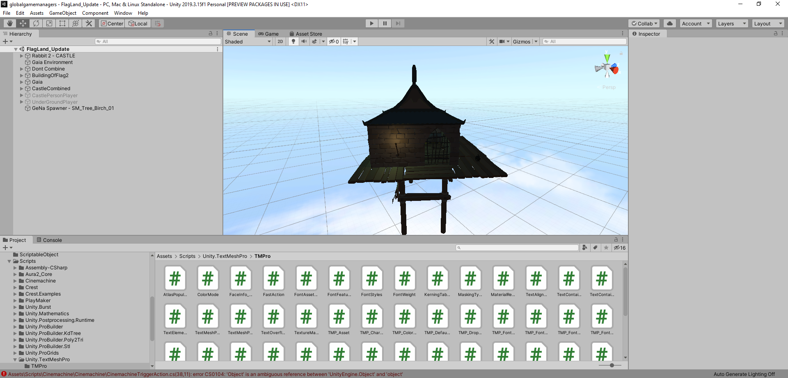
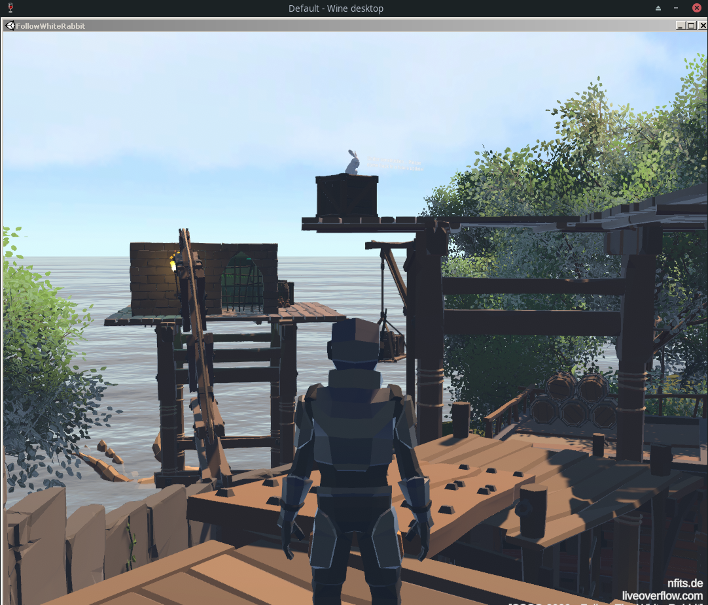
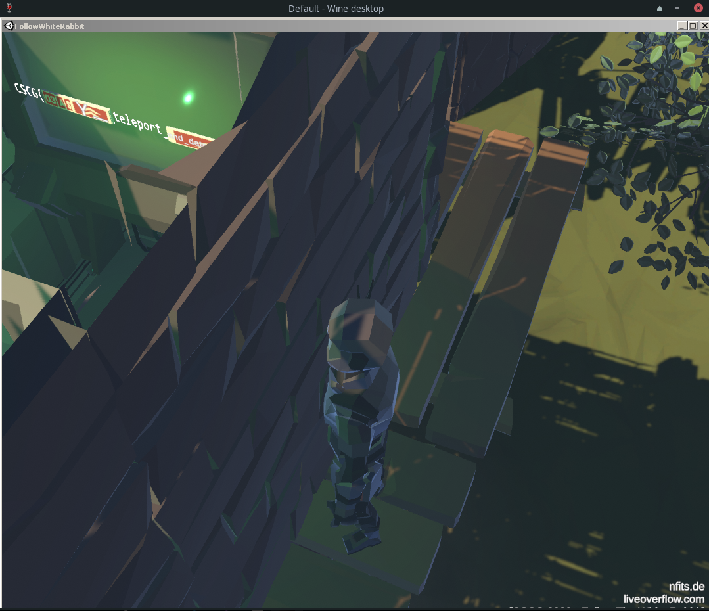

# Follow The White Rabbit - Datamining

## Solution

When watching the trailer, we can see the part that is "accidentally leaked" into the game [here](https://youtu.be/IhLBamqn_5Q?t=64).

Also, if we use [UtinyRipper](https://github.com/mafaca/UtinyRipper) and drag the whole game folder into the game in it, we get a globalgamemanagers file that we can actually open it Unity (2019.3.15f1 is the version I used and it may take _a while_).
Looking at the scenes, we find a scene called "FlagLand_Update" that looks exactly like that hidden prison in the video:




Now, we have to figure out how to actually load the scene into the game. Therefore, I opened `FollowWhiteRabbit/FollowWhiteRabbit_Data/Managed/Assembly-CSharp.dll` in [dnSpy](https://github.com/0xd4d/dnSpy) that decompiles and lets us edit code.
We find a class called `PartialFlag2`:
```cs
using System;
using TMPro;
using UnityEngine;

// Token: 0x02000048 RID: 72
public class PartialFlag2 : MonoBehaviour
{
	// Token: 0x060000DD RID: 221 RVA: 0x000250A8 File Offset: 0x000232A8
	private void Start()
	{
		this.flagProbablyHardToGetStatically();
		TextMeshPro component = base.GetComponent<TextMeshPro>();
		string text = "aof\\`drfe`dbbjQ|st|vg";
		int num = 0;
		for (int i = 0; i < text.Length; i++)
		{
			TextMeshPro textMeshPro = component;
			textMeshPro.text += ((char)((int)text[i] ^ num)).ToString();
			num++;
		}
	}

	// Token: 0x060000DE RID: 222 RVA: 0x00006DB0 File Offset: 0x00004FB0
	private void flagProbablyHardToGetStatically()
	{
		base.GetComponent<TextMeshPro>().text = "";
	}

	// Token: 0x060000DF RID: 223 RVA: 0x000067D1 File Offset: 0x000049D1
	private void Update()
	{
	}
}
```

So, this is probably some part of the flag:
```bash
$ python
>>> s = "aof\\`drfe`dbbjQ|st|vg"
>>> for i in range(len(s)):
...	print(chr(ord(s[i]) ^ i), end="")
...	if i == len(s) - 1:
...		print()
...
and_datamining_scenes
>>>
```

Going back to trying to get `FlagLand_Update` into the game, I found the `SceneLoader` class. This [article](https://docs.unity3d.com/ScriptReference/SceneManagement.LoadSceneMode.html) explains how to add a scene to the game and I edited the `SceneLoader` function accordingly:
```cs
...
	private void Start()
	{
		base.StartCoroutine(this.LoadYourAsyncScene());
		SceneManager.LoadScene("FlagLand_Update", LoadSceneMode.Additive);
	}
...
```

This loads the update into the game, we are however unable to get into the prison due to the door being blocked. Looking for different options, I tried to disable a [GameObject](https://docs.unity3d.com/ScriptReference/GameObject.html).
The roof has the name `PolygonSamurai_Mat_02` (we can view it in the unity editor), so perhaps by disabling it we can look inside and see the flag.
[Here](https://docs.unity3d.com/ScriptReference/GameObject.Find.html) is described how we can find a GameObject by name and [here](https://answers.unity.com/questions/972149/how-to-deactivateactivate-gameobject.html) how we can disable it.
For some reason, it didn't work if I put it directly after loading the function, so I picked a different function where I can put the code that disables the roof. I picked the `showText` class that prints the "under construction" text, so I was sure
that it was being used at least once.

```cs
public class ShowText : MonoBehaviour
{
	// Token: 0x0600024A RID: 586
	private void Start()
	{
		this.text = base.GetComponent<TMP_Text>();
		GameObject.Find("PolygonSamurai_Mat_02").SetActive(false);
	}
...
```

If we now load into the game:



And look inside to get the flag:



Note: We can bypass the first door by jumping over the wall when sprinting and jumping from higher to lower ground. To get to the prison, I jumped on the long thingy that goes into the direction of the prison (may need some tries) and from there we can jump to the prison.

Flag: `CSCG{03ASY_teleport_and_datamining_scenes}`


## Mitigation

Unity assets files can be encrypted, it is noted however that a user determined to extract assets, will most likely be able to. More information can be found here: https://docs.unity3d.com/540/Documentation/Manual/protectingcontent.html
