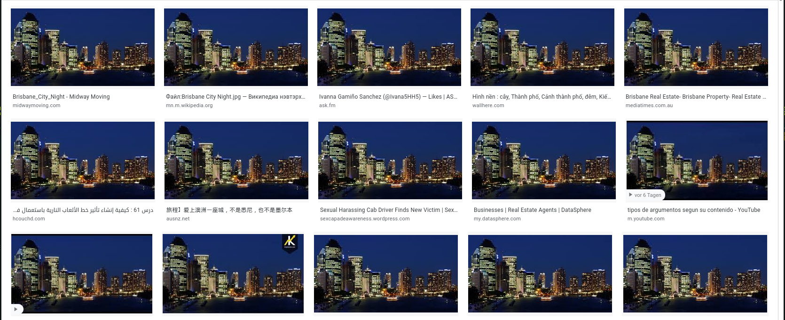
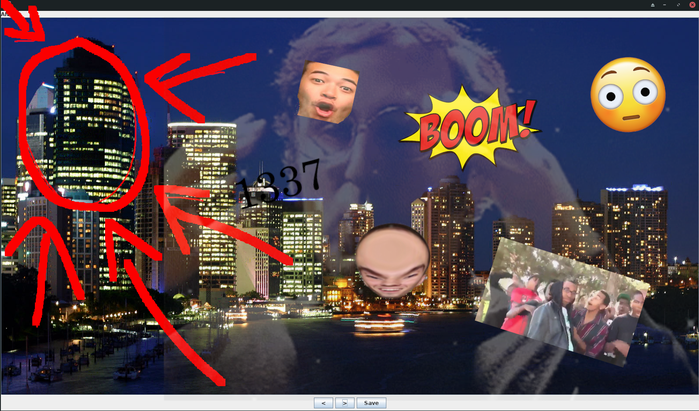

# Intro to Stegano 2

## Solution

It took me quite a while to figure out how to solve this. After a while I thought of searching for the original image and comparing it with the `chall.jpg`.
We can easily do this with the google image reverse search:
<br/> <br/>

<br/><br/>
Looks like it is [Brisbane City at night](https://upload.wikimedia.org/wikipedia/commons/0/05/Brisbane_City_Night.jpg). Comparing exifdata of both images doesn't reveal anything interesting, hex data shows some differences, but nothing interesting.
Guess I can try to combine both images and see if there's anything, [`stegsolve`](http://www.caesum.com/handbook/stego.htm) has a neat feature for that:
<br/><br/>

<br/>
As we can clearly see in the image, these windows look quite suspicious, maybe we can interpret them as binary (with some corrections):
```
01000011
01010011
01000011
01000111
01111011
01100001
01011111
01000110
01101100
00110100
01100111
01111101
```
Flag: `CSCG{a_Fl4g}`


## Mitigation

Don't hide plaintext data in images. Use a known E2E method to transfer sensitive data.
