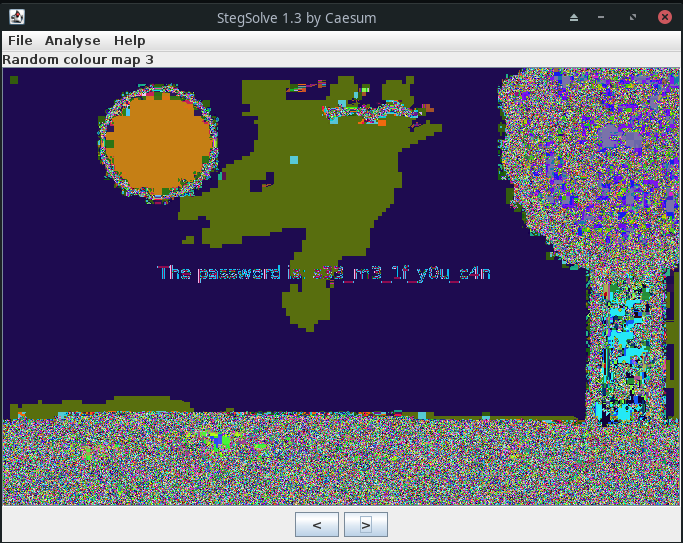

# Intro to Stegano 3

## Solution

Loading the image in stegsolve and skipping through the options:
<br/> <br/>

<br/> <br/>
We got a password: `s33_m3_1f_y0u_c4n`. So, there is probably some zip file or similar hidden in the image:
```
$ binwalk chall.png

DECIMAL       HEXADECIMAL     DESCRIPTION
--------------------------------------------------------------------------------
0             0x0             PNG image, 676 x 437, 8-bit/color RGBA, non-interlaced
99            0x63            Zlib compressed data, best compression
299068        0x4903C         Zip archive data, encrypted compressed size: 48, uncompressed size: 28, name: flag.txt
299266        0x49102         End of Zip archive, footer length: 22
```
<br/>

We can then extract these files with `binwalk --dd=".*" chall.png` and then unpack the file with `flag.txt` in it using `7z x 4903C` and entering the password we found earlier.

Flag: `CSCG{H1dden_1n_pla1n_s1ght}`

## Mitiagtion

Do not hide data in images in plaintext. Use a known E2E method to safely transfer sensitive data.
