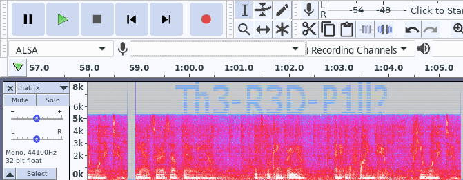
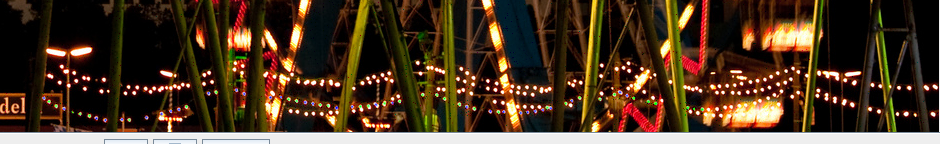
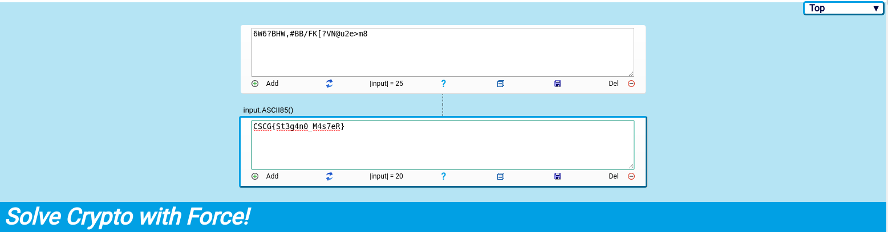

# Matrix

## Solution

We are given an audio file (`.wav`) and the first thing that came to my mind was [this tweet](https://twitter.com/_johnhammond/status/1244277165316857857) of John Hammond I saw recently
saying that you should always check the spectogram of an audio file for hidden information, so I did exactly this:
<br/> <br/>

<br/> <br/>
We got password, let's see if there is anything password protected in the audio file:
```
$ steghide extract -sf matrix.wav
Enter passphrase: 
wrote extracted data to "redpill.jpg".
```
Running [`binwalk`](https://github.com/ReFirmLabs/binwalk)  on `redpill.jpg` reveals that there is also hidden zip archive with `secret.txt`:
```
$ binwalk -Me redpill.jpg

Scan Time:     2020-05-08 19:37:11
Target File:   /home/layton/Desktop/cscg/Matrix/redpill.jpg
MD5 Checksum:  b8c65e3f3a95688db633031b56263c0d
Signatures:    391

DECIMAL       HEXADECIMAL     DESCRIPTION
--------------------------------------------------------------------------------
0             0x0             JPEG image data, JFIF standard 1.01
906949        0xDD6C5         Zip archive data, encrypted at least v1.0 to extract, compressed size: 38, uncompressed size: 26, name: secret.txt
907151        0xDD78F         End of Zip archive, footer length: 22


Scan Time:     2020-05-08 19:37:11
Target File:   /home/layton/Desktop/cscg/Matrix/_redpill.jpg.extracted/secret.txt
MD5 Checksum:  d41d8cd98f00b204e9800998ecf8427e
Signatures:    391
```
Trying to `unzip DD6C5.zip` prompts us for another password, it's either hidden in the audio file or what's more likely in the `redpill.jpg` image. 
<br/>
After trying a lot of different things, I figured to try the same method as in Intro to Stegano 2. Reverse image search gives us [this image](https://img.fotocommunity.com/oktoberfest-bei-nacht-mit-vollmond-05261355-dabf-4ba3-8fd3-cef78ebe9a74.jpg?height=1080).
Putting both images into the image combiner tool of stegsolve, we can see the following in the `AND` mode upon close inspection:
<br/> <br/>

<br/> <br/>
Interpreting blue as `0` and green as `1`:<br/>
```
Binary:
0110111000100001010000110011001101011111010100000101011100111111
ASCII:
n!C3_PW?
```
Looks like this might be our password for `DD6C5.zip`:
```
Archive:  DD6C5.zip
[DD6C5.zip] secret.txt password: n!C3_PW?
replace secret.txt? [y]es, [n]o, [A]ll, [N]one, [r]ename: y
 extracting: secret.txt
```
```
$ cat secret.txt
6W6?BHW,#BB/FK[?VN@u2e>m8
```
Hm, looks like some encoded string. I couldn't figure out what encoding was used, so I searched online for program that can figure out the encoding for me and I found this awesome
[repository](https://github.com/DaWouw/SCWF) with the live version at https://scwf.dima.ninja/ (only works in chrome) that uses different analysis methods to automaticaly figure out the encoding.
And it seems to work pretty well:
<br/> <br/>

<br/> <br/>

Flag: `CSCG{St3g4n0_M4s7eR}`


## Mitigation

Don't try to hide plaintext information in images, I guess.
