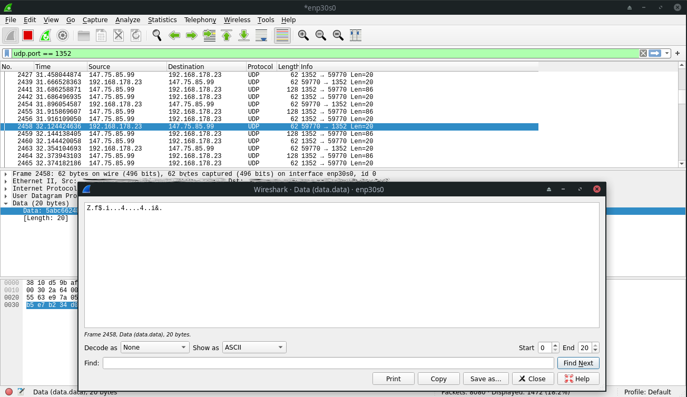
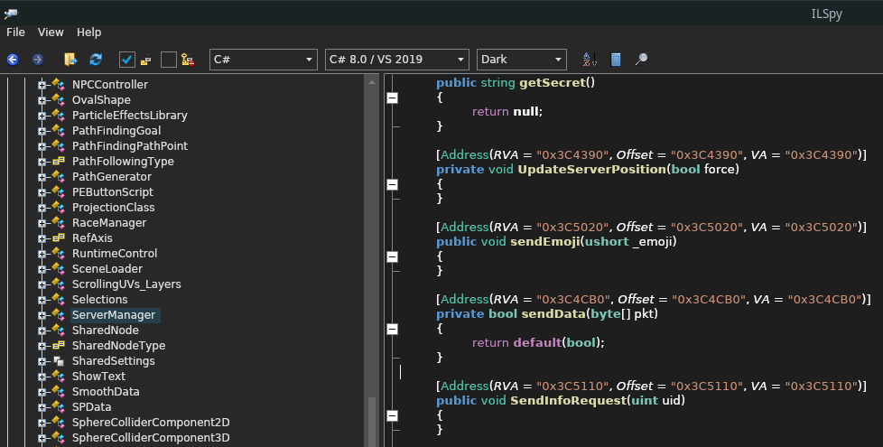
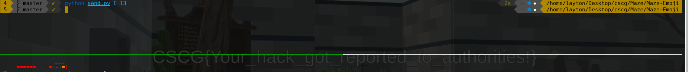

# Maze - Emoji

## Solution

Since it's an online game and we send data to the server, I decided to look at the data being sent from the client to the server. Perhaps it just sends plaintext data and we can try to temper with that, otherwise we would have to reverse the encryption scheme and try to craft our own data packets. <br/>
To take a first look at the traffic, I used [Wireshark](https://www.wireshark.org/), we can simply filter the traffic by the udp port that the game tells us we are connected to:



Looks like non-sense, guess we have to reverse the encryption. But before we do that, we can try some other things:
- The tool [UtinyRipper](https://github.com/mafaca/UtinyRipper) used in the Follow The White Rabbit challenge to extract assetfiles didn't work
- Memory scanners like [scanmem](https://github.com/scanmem/scanmem) (more or less the linux version of cheat engine) didn't work for me either, the game just crashes

When looking at the game files, we find a directory called `il2cpp_data`. Il2Cpp comes in place if you create a unity game for multiple platforms, it basically converts the IL code and assemblies to C++ before creating the binary executable file for the specific platform. More information can be found here: https://docs.unity3d.com/Manual/IL2CPP.html.

As it turns out there is a tool called [Il2CppDumper](https://github.com/Perfare/Il2CppDumper) that can restore some information from files compiled with Il2Cpp and also has scripts that support ghidra and ida.
If we run `Il2CppDumper` on the `GameAssembly.so` file and supplying it with the metadata file located at `Maze_v2_Data/il2cpp_data/Metadata/global-metadata.dat`, it creates a `DummyDll` directory and a `config.json` file (not `script.json` as the ghidra/ida script tells us :rage:).

We can take a look at the `Assembly-CSharp.dll` in the `DummlyDll` directory created by Il2CppDumper and find the class `ServerManager` and the function `sendData`, this will be most likely our target to reverse engineer:



Let's load the `GameAssembly.so` into IDA, use the Il2CppDumper `ida_with_struct.py` script with the `config.json` and go to the [`sendData.c`](sendData.c) function:
```c
bool __fastcall ServerManager__sendData(ServerManager_o *this, System_Byte_array *pkt)
{
  void *v2; // rdx
  int v3; // ecx
  int v4; // er8
  char v5; // r9
  System_Byte_array *v6; // r15
  ServerManager_o *v7; // r14
  __int64 v8; // r12
  System_Random_o *v9; // rdi
  int v10; // ebx
  System_Random_o *v11; // rdi
  char v12; // al
  unsigned int v13; // edx
  unsigned int v14; // esi
  __int64 v15; // rcx
  unsigned __int64 v16; // rax
  __int64 v17; // rdi
  __int64 v18; // rbx
  System_Net_Sockets_UdpClient_o *v19; // rdi
  __int64 v21; // rax
  __int64 v22; // rax
  __int64 v23; // rax
  __int64 v24; // rax
  __int64 v25; // rax
  __int128 v26; // [rsp+0h] [rbp-38h]

  v6 = pkt;
  v7 = this;
  if ( !byte_1135A52 )
  {
    this = (ServerManager_o *)(&stru_2457 + 16);
    sub_322830(9319, (int)pkt, v2, v3, v4, v5);
    byte_1135A52 = 1;
  }
  if ( !pkt )
    sub_3230B0(this);
  v8 = il2cpp_array_new_specific_0(Class_byte__, (unsigned int)(LODWORD(pkt->max_length) + 2));
  v9 = v7->rand;
  if ( !v9 )
    sub_3230B0(0LL);
  LOBYTE(v10) = ((__int64 (__fastcall *)(System_Random_o *, __int64, __int64, void *))v9->klass->vtable._5_Next.methodPtr)(
                  v9,
                  1LL,
                  255LL,
                  v9->klass->vtable._5_Next.method);
  if ( !v8 )
    sub_3230B0(v9);
  if ( !*(_DWORD *)(v8 + 24) )
  {
    v26 = 0LL;
    v24 = sub_2BC6E0(*(_QWORD *)&qword_113C4B0, "System", "IndexOutOfRangeException", &v26);
    sub_322D10(v24, 0LL);
  }
  *(_BYTE *)(v8 + 32) = v10;
  v11 = v7->rand;
  if ( !v11 )
    sub_3230B0(0LL);
  v12 = ((__int64 (__fastcall *)(System_Random_o *, __int64, __int64, void *))v11->klass->vtable._5_Next.methodPtr)(
          v11,
          1LL,
          255LL,
          v11->klass->vtable._5_Next.method);
  if ( (unsigned int)*(_QWORD *)(v8 + 24) <= 1 )
  {
    v26 = 0LL;
    v25 = sub_2BC6E0(*(_QWORD *)&qword_113C4B0, "System", "IndexOutOfRangeException", &v26);
    sub_322D10(v25, 0LL);
  }
  v13 = *(_QWORD *)(v8 + 24);
  *(_BYTE *)(v8 + 33) = v12;
  if ( (int)pkt->max_length > 0 )
  {
    v14 = pkt->max_length;
    v15 = 0x200000000LL;
    v16 = 0LL;
    do
    {
      if ( v16 >= v14 )
      {
        v26 = 0LL;
        v21 = sub_2BC6E0(*(_QWORD *)&qword_113C4B0, "System", "IndexOutOfRangeException", &v26);
        sub_322D10(v21, 0LL);
      }
      v17 = v16 + 2;
      if ( v16 + 2 >= v13 )
      {
        v26 = 0LL;
        v22 = sub_2BC6E0(*(_QWORD *)&qword_113C4B0, "System", "IndexOutOfRangeException", &v26);
        sub_322D10(v22, 0LL);
      }
      *(_BYTE *)(v8 + (v15 >> 32) + 32) = v10 ^ v6->m_Items[v16];
      if ( (unsigned int)*(_QWORD *)(v8 + 24) <= 1 )
      {
        v26 = 0LL;
        v23 = sub_2BC6E0(*(_QWORD *)&qword_113C4B0, "System", "IndexOutOfRangeException", &v26);
        sub_322D10(v23, 0LL);
      }
      v13 = *(_QWORD *)(v8 + 24);
      v18 = (unsigned __int8)v10 + (unsigned int)*(unsigned __int8 *)(v8 + 33);
      v10 = v18 + ((unsigned __int64)(2155905153LL * v18) >> 39);
      v14 = v6->max_length;
      v15 += 0x100000000LL;
      ++v16;
    }
    while ( v17 - 1 < (int)v14 );
  }
  v19 = v7->client;
  if ( !v19 )
    sub_3230B0(0LL);
  System_Net_Sockets_UdpClient__Send(v19, (System_Byte_array *)v8, v13);
  return 1;
}
```

We can see that the first two bytes of the packet we send are two random numbers between 1 and 255:
```c
LOBYTE(v10) = ((__int64 (__fastcall *)(System_Random_o *, __int64, __int64, void *))v9->klass->vtable._5_Next.methodPtr)...
v12 = ((__int64 (__fastcall *)(System_Random_o *, __int64, __int64, void *))v11->klass->vtable._5_Next.methodPtr)...
...
*(_BYTE *)(v8 + 32) = v10;
*(_BYTE *)(v8 + 33) = v12;
```

Afterwards comes a do-while loop that goes through the rest of the packet and XORs it with the first random number and then calculates a new "first random number" for the next loop:
```c
*(_BYTE *)(v8 + (v15 >> 32) + 32) = v10 ^ v6->m_Items[v16];
v18 = (unsigned __int8)v10 + (unsigned int)*(unsigned __int8 *)(v8 + 33);
v10 = v18 + ((unsigned __int64)(2155905153LL * v18) >> 39);
```
We can now write a simple program that decodes a packet, however we do not know what meaning each value has. I therefore looked at the [`UpdateServerPosition.c`](UpdateServerPosition.c) function:
```c
...
v8 = (_DWORD *)&this->lastUpdate;
v9 = (_QWORD *)&this->current_position.x;
v10 = (int *)&this->current_position.z;
v11 = (_QWORD *)&this->position.x;
v12 = (int *)&this->position.z;
v13 = (_QWORD *)&this->current_eulerAngles.x;
v14 = (int *)&this->current_eulerAngles.z;
v15 = (_QWORD *)&this->eulerAngles.x;
v16 = &this->eulerAngles.z;
...
System_Buffer__BlockCopy((System_Array_o *)v6->usersecret, 0, (System_Array_o *)v49, 1, 8);
...
v107 = SLODWORD(v6->position.y);
...
```
These are some examples from the function that lets us identify what each value in the decoded packet means and we get that overall:
```
Position Update Packet
----
0:      Indicator (P, I, E, <3)
1-8:    usersecret
9-16:   time * 100000
17-20:  position_x * 10000
21-24:  position_y * 10000
25-28:  position_z * 10000
29-32:  eulerAngle_x * 10000
33-36:  eulerAngle_y * 10000
37-40:  eulerAngle_z * 10000
41:     trigger
42:     groundedblend
43:     notgroundedblend
44:     ?
```

Putting all these pieces of information together, I wrote a program that lets use decode packets:
```python
#!/usr/bin/env python3

import sys


for data in sys.stdin:

    r = bytearray.fromhex(data)

    first_random    = r[0]
    second_random   = r[1]

    decoded = []

    print("First Random:", first_random)
    print("Second Random:", second_random)

    for i in range(0, len(r) - 2):

        decoded.append(first_random ^ r[i+2])

        v21 = first_random + second_random
        first_random = (v21 + ((2155905153 * v21) >> 39)) & 0xff

    start = 0

    if chr(decoded[0]) == "<":

        indicator = chr(decoded[0]) + chr(decoded[1])
        start += 1

    else:
        indicator = chr(decoded[0])

    secret      = decoded[start+1:start+9]
    time        = int.from_bytes(decoded[start+9:start+17], byteorder="little")
    position_x  = int.from_bytes(decoded[start+17:start+21], byteorder="little")
    position_y  = int.from_bytes(decoded[start+21:start+25], byteorder="little")
    position_z  = int.from_bytes(decoded[start+25:start+29], byteorder="little")
    euler_x     = int.from_bytes(decoded[start+29:start+33], byteorder="little")
    euler_y     = int.from_bytes(decoded[start+33:start+37], byteorder="little")
    euler_z     = int.from_bytes(decoded[start+37:start+41], byteorder="little")

    print("Bytearray:", decoded)
    print("Indicator:", indicator)
    print("Time:", time)
    print("Secret:", secret)
    print("Position X:", int(position_x / 10000))
    print("Position Y:", int(position_y / 10000))
    print("Position Z:", int(position_z / 10000))
    print("Euler X:", int(euler_x / 10000))
    print("Euler Y:", int(euler_y / 10000))
    print("Euler Z:", int(euler_z / 10000))
    print("-"*20)
```

Now we get to the actual part of the emoji challenge. Let's see what an emoji packet looks like.
```
$ echo "7c91395566c92f2052e70e8d" | python programs/decoder.py
...
Bytearray: [69, 91, 249, 248, 237, 116, 183, 144, 7, 23]
...
```
If we try a different emoji:
```
$ echo "72603789ca6b1e20038572c3" | python programs/decoder.py
...
Bytearray: [69, 91, 249, 248, 237, 116, 183, 144, 7, 22]
...
```
Looks like only the last value changes, which determines the emoji.

Writing a program that allows us to send emoji packets with an emoji of our choice (this program can also send position packets):
```python
#!/usr/bin/env python3

from scapy.all import sniff
import subprocess
import socket
import sys


p = subprocess.run("netstat -u | grep 'hax' | awk -F' ' '{ print $4 }' | awk -F':' '{ print $2 }'", shell=True, stdout=subprocess.PIPE)
LOCAL_PORT  = int(p.stdout.decode("utf-8").split("\n")[0])
REMOTE_IP   = "maze.liveoverflow.com"
SECRET      = [91, 249, 248, 237, 116, 183, 144, 7]
FILTER      = "udp and ( " + " or ".join(["dst port " + str(1337 +i) for i in range(21)]) + " )"


def getT():

    t = False

    while not t:

        pkt = sniff(filter=FILTER, count=1)

        r = bytes(pkt[0]["Raw"][0]).hex()

        if len(r) == 96:
            r = decode(r)
            t = int.from_bytes(r[9:17], byteorder="little")

    return int(t)


def decode(data):

    r = bytearray.fromhex(data)

    first_random    = r[0]
    second_random   = r[1]
    decoded = []

    for i in range(0, len(r) - 2):

        decoded.append(first_random ^ r[i+2])

        v21 = first_random + second_random
        first_random = (v21 + ((2155905153 * v21) >> 39)) & 0xff

    return decoded


def send(data, s):

    for remote_port in range(1337, 1358):
        for _ in range(0,3):
            s.sendto(data, (REMOTE_IP, remote_port))

    return


def encode(packet):

    encoded_packet = []

    random_0 = 24
    random_1 = 123

    encoded_packet.append(random_0)
    encoded_packet.append(random_1)

    for v in packet:

        encoded_packet.append(v ^ random_0)

        v21 = random_0 + random_1
        random_0 = (v21 + ((2155905153 * v21) >> 39)) & 0xff

    return bytes(encoded_packet)


def position(x, y, z):

    t = getT() + 10000

    packet = [80] + SECRET + [ b for b in int.to_bytes(t, length=8, byteorder="little") ]

    pos_x = int.to_bytes(x * 10000, length=4, byteorder="little")
    for i in range(0, 4):
        packet.append(pos_x[i])

    pos_y = struct.pack("<i", y * 10000)    # using struct so we can use negative values
    for i in range(0, 4):
        packet.append(pos_y[i])

    pos_z = int.to_bytes(z * 10000, length=4, byteorder="little")
    for i in range(0, 4):
        packet.append(pos_z[i])

    packet += [0, 0, 0, 0, 0, 161, 86, 53, 0, 0, 0, 0, 0, 1, 0, 1, 1]    # we don't care about euler values

    return packet


def emoji(n):

    packet = [69] + SECRET + [n]

    return packet


def main():

    sock = socket.socket(socket.AF_INET, socket.SOCK_DGRAM)
    sock.setsockopt(socket.SOL_SOCKET, socket.SO_REUSEADDR, 1)
    sock.bind(("", LOCAL_PORT))

    if sys.argv[1] == "P":

        x = int(sys.argv[2])
        y = int(sys.argv[3])
        z = int(sys.argv[4])
        pkt = encode(position(x,y,z))
        for _ in range(3):
            send(pkt, sock)

    elif sys.argv[1] == "E":

        n = int(sys.argv[2])
        send(encode(emoji(n)), sock)


if __name__ == "__main__":
    main()
```
If we type `python send.py E 13`, we are greeted with the flag:



Flag: `CSCG{Your_hack_got_reported_to_authorities!}`


## Mitigation

Try to trust the client as less as possbile and handle all the game logic server-side (and verify if the emoji for example is already unlocked). Don't give the client the authority to say "I am at position XYZ", but rather "I moved left, right, ..." and verify that it doesn't exceed a certain limit that the player is allowed to usually move. 

A harder to reverse algorithm or adding encryption is also helpful, this however depending on the algorithm may lead to additional delay, what can be especially in FPS games or other time relevant games a crucial disadvantage. A good balance between securing online games, ensuring a smooth gameplay experience and protecting the privacy of users
(looking at you vanguard anti-cheat) should be aimed for.
