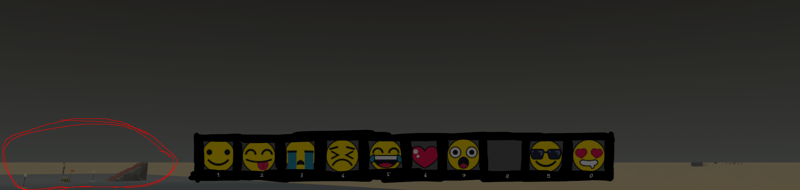
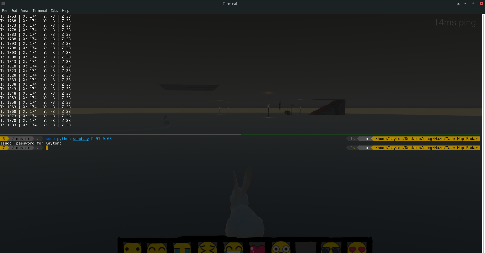
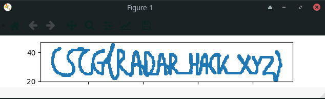

# Maze - Map Radar

## Solution

I unlocked the teleporter by teleporting myself into the sky and then walking on the walls (also sometimes teleporting though walls). To do so, I used the script I mentioned in the Maze - Emoji challenge:
```python
#!/usr/bin/env python3

from scapy.all import sniff
import subprocess
import socket
import sys


p = subprocess.run("netstat -u | grep 'hax' | awk -F' ' '{ print $4 }' | awk -F':' '{ print $2 }'", shell=True, stdout=subprocess.PIPE)
LOCAL_PORT  = int(p.stdout.decode("utf-8").split("\n")[0])
REMOTE_IP   = "maze.liveoverflow.com"
SECRET      = [91, 249, 248, 237, 116, 183, 144, 7]
FILTER      = "udp and ( " + " or ".join(["dst port " + str(1337 +i) for i in range(21)]) + " )"


def getT():

    t = False

    while not t:

        pkt = sniff(filter=FILTER, count=1)

        r = bytes(pkt[0]["Raw"][0]).hex()

        if len(r) == 96:
            r = decode(r)
            t = int.from_bytes(r[9:17], byteorder="little")

    return int(t)


def decode(data):

    r = bytearray.fromhex(data)

    first_random    = r[0]
    second_random   = r[1]
    decoded = []

    for i in range(0, len(r) - 2):

        decoded.append(first_random ^ r[i+2])

        v21 = first_random + second_random
        first_random = (v21 + ((2155905153 * v21) >> 39)) & 0xff

    return decoded


def send(data, s):

    for remote_port in range(1337, 1358):
        for _ in range(0,3):
            s.sendto(data, (REMOTE_IP, remote_port))

    return


def encode(packet):

    encoded_packet = []

    random_0 = 24
    random_1 = 123

    encoded_packet.append(random_0)
    encoded_packet.append(random_1)

    for v in packet:

        encoded_packet.append(v ^ random_0)

        v21 = random_0 + random_1
        random_0 = (v21 + ((2155905153 * v21) >> 39)) & 0xff

    return bytes(encoded_packet)


def position(x, y, z):

    t = getT() + 10000

    packet = [80] + SECRET + [ b for b in int.to_bytes(t, length=8, byteorder="little") ]

    pos_x = int.to_bytes(x * 10000, length=4, byteorder="little")
    for i in range(0, 4):
        packet.append(pos_x[i])

    pos_y = struct.pack("<i", y * 10000)    # using struct so we can use negative values
    for i in range(0, 4):
        packet.append(pos_y[i])

    pos_z = int.to_bytes(z * 10000, length=4, byteorder="little")
    for i in range(0, 4):
        packet.append(pos_z[i])

    packet += [0, 0, 0, 0, 0, 161, 86, 53, 0, 0, 0, 0, 0, 1, 0, 1, 1]    # we don't care about euler values

    return packet


def emoji(n):

    packet = [69] + SECRET + [n]

    return packet


def main():

    sock = socket.socket(socket.AF_INET, socket.SOCK_DGRAM)
    sock.setsockopt(socket.SOL_SOCKET, socket.SO_REUSEADDR, 1)
    sock.bind(("", LOCAL_PORT))

    if sys.argv[1] == "P":

        x = int(sys.argv[2])
        y = int(sys.argv[3])
        z = int(sys.argv[4])
        pkt = encode(position(x,y,z))
        for _ in range(3):
            send(pkt, sock)

    elif sys.argv[1] == "E":

        n = int(sys.argv[2])
        send(encode(emoji(n)), sock)


if __name__ == "__main__":
    main()

```

This script is used to change my position is not 100% reliable, so you may need to give it a few tries before it actually works (I wasn't able to figure what was causing the script to not work sometimes).

I additionally used this script to keep track of my current position by intercepting the traffic:
```python
#!/usr/bin/env python3

from scapy.all import sniff
import struct

filter_udp = "udp and ( " + " or ".join(["dst port " + str(1337 + i) for i in range(21)]) + " )"
TIME = 0

def decode(data):

    r = bytearray.fromhex(data)

    first_random    = r[0]
    second_random   = r[1]
    decoded = []

    for i in range(0, len(r) - 2):

        decoded.append(first_random ^ r[i+2])

        v21 = first_random + second_random
        first_random = (v21 + ((2155905153 * v21) >> 39)) & 0xff

    return decoded


def pkt_callback(pkt): # pkt: "Ethernet", "IP", "UDP", "Raw" 

    global TIME

    r = bytes(pkt["Raw"]).hex()

    if len(r) == 96:
        r = decode(r)
        t = struct.unpack("<q", bytes(r[9:17]))[0] / 10000
        x = struct.unpack("<i", bytes(r[17:21]))[0] / 10000
        y = struct.unpack("<i", bytes(r[21:25]))[0] / 10000
        z = struct.unpack("<i", bytes(r[25:29]))[0] / 10000

        print("T:", int(t), "|", "X:", int(x), "|", "Y:", int(y), "|", "Z", int(z))

try:
    sniff(prn=pkt_callback, filter=filter_udp, store=0)
except KeyboardInterrupt:
    pass
```
It is necessary to know the current location since it is not possible to teleport anywhere with this method. There is a certain limit of about 10 units in X- or Z-direction at a time.
So, if you want to teleport yourself on the other side of the map, this isn't probably going to work. We can however change the Y-axis and walk on the edges of the walls.

The description of Maze - Map radar says: `There are rumours of a player who found a secret place and walks in a weird pattern. A radar map could be useful.`.

Secret place... My assumption was that there is either some place hidden in a larger wall or underground. I first tried to telport myself into bigger walls to see if there is anything inside them and then I saw this in a somewhat bugged way when trying to look underneath:



There is the chest, looks like the secret place we're looking for. After finally finding the right entry, we see a rabbit walking around:



"A radar map could be useful.", means probably that the rabbit is drawing the flag on the coordinate system. Since I already have a program that captures my coordinates, I decided to follow the rabbit and pipe the output of my program into a file, extract the X- and Y-Coordinates and put them on a coordinate system:
```python
#!/usr/bin/env python3

import matplotlib.pyplot as plt
import numpy as np

x = [ int(x) for x in open("X.txt", "r").read().split("\n") if x != ""]
y = [ int(y) for y in open("Y.txt", "r").read().split("\n") if y != ""]

plt.scatter(x, y, s=5)
plt.show()
```
And the result (if we adjust the winow scaling a bit):



Flag: `CSCG{RADAR_HACK_XYZ}`


## Mitigation

The same as in the Maze - Emoji writeup.
