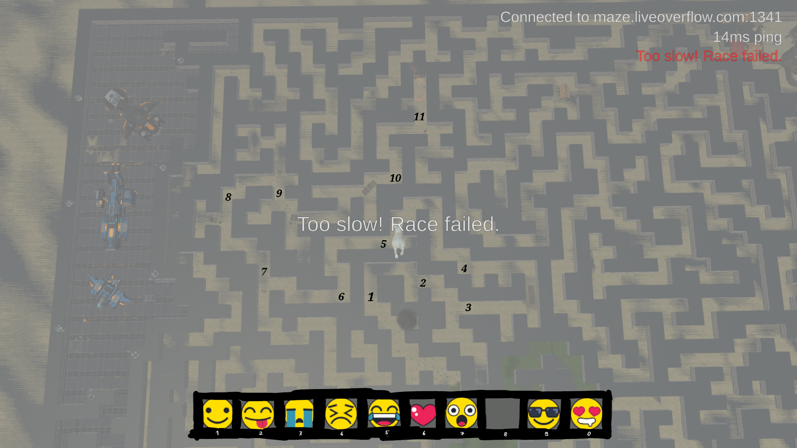
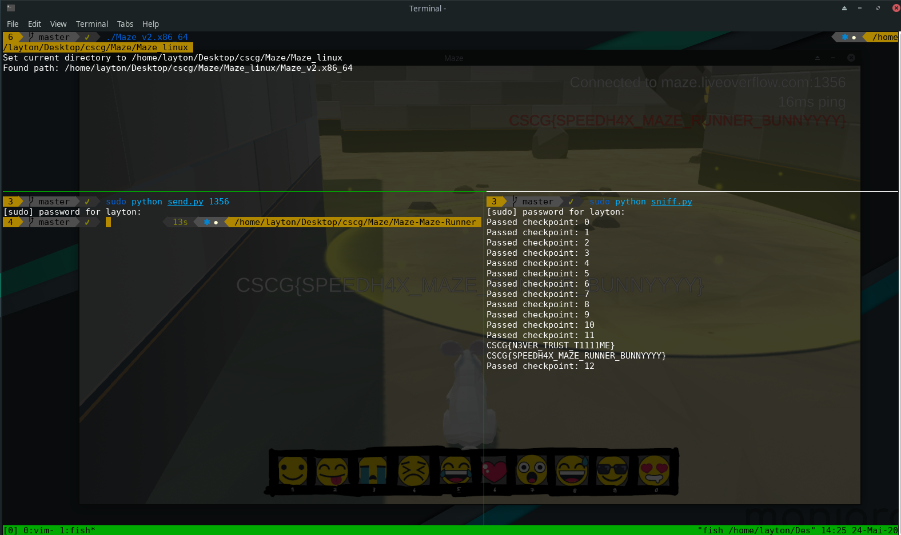

# Maze - M4z3 Runn3r

## Solution

At first, I tried to get an overview of all checkpoints and teleported myself in the sky with the same script as explained in the Maze - Emoji write-up:



Also, while looking at the traffic being sent from the server to the client when we enter a checkpoint, I noticed that there is a packet that starts with "R" and the next byte is the checkpoint number.
So, by sniffing the traffic being sent from the server to the client, we can verify that the server accepted the checkpoint and additionally look out for the flag:
```python
#!/usr/bin/env python3

from scapy.all import sniff
import struct

filter_udp = "udp and ( " + " or ".join(["src port " + str(1337 +i) for i in range(21)]) + " )"

def decode(data):

    r = bytearray.fromhex(data)

    first_random    = r[0]
    second_random   = r[1]
    decoded = []

    for i in range(0, len(r) - 2):

        decoded.append(first_random ^ r[i+2])

        v21 = first_random + second_random
        first_random = (v21 + ((2155905153 * v21) >> 39)) & 0xff

    return decoded


def pkt_callback(pkt): # pkt: "Ethernet", "IP", "UDP", "Raw" 

    r = bytes(pkt["Raw"]).hex()

    r = decode(r)

    if r[0] == 82:
        print("Passed checkpoint:", r[1])
        return

    string = "".join([chr(r) for r in r])

    if "CSCG" in string:
        print(string)

    return

try:
    sniff(prn=pkt_callback, filter=filter_udp, store=0)
except KeyboardInterrupt:
    pass
```

Next, I modified the script that sends the "fake" positions to the server and collected the coordinates to get from checkpoint to checkpoint without exceeding the limit
of about 10 units at a time, otherwise the server will not accept it.

```python
#!/usr/bin/env python3

from scapy.all import sniff
import struct

filter_udp = "udp and ( " + " or ".join(["dst port " + str(1337 +i) for i in range(21)]) + " )"

def decode(data):

    r = bytearray.fromhex(data)

    first_random    = r[0]
    second_random   = r[1]
    decoded = []

    for i in range(0, len(r) - 2):

        decoded.append(first_random ^ r[i+2])

        v21 = first_random + second_random
        first_random = (v21 + ((2155905153 * v21) >> 39)) & 0xff

    return decoded


def pkt_callback(pkt): # pkt: "Ethernet", "IP", "UDP", "Raw" 

    r = bytes(pkt["Raw"]).hex()

    if len(r) == 96:
        r = decode(r)
        t = struct.unpack("<q", bytes(r[9:17]))[0] / 10000
        x = struct.unpack("<i", bytes(r[17:21]))[0] / 10000
        y = struct.unpack("<i", bytes(r[21:25]))[0] / 10000
        z = struct.unpack("<i", bytes(r[25:29]))[0] / 10000

        print("T:", int(t), "|", "X:", int(x), "|", "Y:", int(y), "|", "Z", int(z))

try:
    sniff(prn=pkt_callback, filter=filter_udp, store=0)
except KeyboardInterrupt:
    pass
```

By using the map and this ^ script I slowly collected the coordinates to teleport through the maze and verified when reaching a new checkpoint that the script worked by looking
at the answers from the server (using the script I mentioned at the beginning).
At the end we get the following script to teleport to every checkpoint:
```python
#!/usr/bin/env python3

from scapy.all import sniff
import subprocess
import socket
import sys
import time


p = subprocess.run("netstat -u | grep 'hax' | awk -F' ' '{ print $4 }' | awk -F':' '{ print $2 }'", shell=True, stdout=subprocess.PIPE)
LOCAL_PORT  = int(p.stdout.decode("utf-8").split("\n")[0])
REMOTE_IP   = "maze.liveoverflow.com"
REMOTE_PORT = int(sys.argv[1])
SECRET      = [91, 249, 248, 237, 116, 183, 144, 7]
FILTER      = "udp and ( " + " or ".join(["dst port " + str(1337 +i) for i in range(21)]) + " )"


def getT():

    t = False

    while not t:

        pkt = sniff(filter=FILTER, count=1)

        r = bytes(pkt[0]["Raw"][0]).hex()

        if len(r) == 96:
            r = decode(r)
            t = int.from_bytes(r[9:17], byteorder="little")

    return int(t)


def decode(data):

    r = bytearray.fromhex(data)

    first_random    = r[0]
    second_random   = r[1]
    decoded = []

    for i in range(0, len(r) - 2):

        decoded.append(first_random ^ r[i+2])

        v21 = first_random + second_random
        first_random = (v21 + ((2155905153 * v21) >> 39)) & 0xff

    return decoded


def send(data, s):

    s.sendto(data, (REMOTE_IP, REMOTE_PORT))

    return


def encode(packet):

    encoded_packet = []

    random_0 = 24
    random_1 = 123

    encoded_packet.append(random_0)
    encoded_packet.append(random_1)

    for v in packet:

        encoded_packet.append(v ^ random_0)

        v21 = random_0 + random_1
        random_0 = (v21 + ((2155905153 * v21) >> 39)) & 0xff

    return bytes(encoded_packet)


def position(x, y, z):

    packets = []
    t = getT() + 4750

    for n in range(len(x)):

        packet = [80] + SECRET + [ b for b in int.to_bytes(t, length=8, byteorder="little") ]

        pos_x = int.to_bytes(x[n] * 10000, length=4, byteorder="little")
        for i in range(0, 4):
            packet.append(pos_x[i])

        pos_y = struct.pack("<i", y[n] * 10000)
        for i in range(0, 4):
            packet.append(pos_y[i])

        pos_z = int.to_bytes(z[n] * 10000, length=4, byteorder="little")
        for i in range(0, 4):
            packet.append(pos_z[i])

        packet += [0, 0, 0, 0, 0, 161, 86, 53, 0, 0, 0, 0, 0, 1, 0, 1, 1]    # we don't care about euler values

        packets.append(packet)

        t += 6000

    return packets


def main():

    sock = socket.socket(socket.AF_INET, socket.SOCK_DGRAM)
    sock.setsockopt(socket.SOL_SOCKET, socket.SO_REUSEADDR, 1)
    sock.bind(("", LOCAL_PORT))

    x = [ 203, 197, 192, 192, 185, 182, 175, 169, 168, 168, 168, 171, 173, 176, 181, 184, 185, 185, 184, 177, 171, 166, 162, 160, 157, 155, 153, 150, 150, 150,
          150, 150, 150, 150, 150, 150, 152, 158, 163, 168, 174, 179, 179, 178, 177, 177, 176, 173, 171, 169, 167, 162, 158, 156, 153, 150, 148, 144, 138, 132,
          127, 121, 118, 116, 116, 116, 117, 121, 125, 129, 132, 132, 132, 132, 132, 128, 124, 122, 119, 117, 116, 113, 112, 106, 100,  94,  88,  86,  83,  81,
           77,  71,  65,  61 ]

    z = [ 191, 191, 191, 184, 184, 180, 180, 181, 187, 194, 201, 206, 211, 216, 220, 223, 228, 231, 235, 235, 235, 233, 230, 226, 223, 219, 215, 212, 205, 199,
          193, 187, 181, 176, 170, 164, 159, 159, 159, 161, 161, 161, 155, 150, 144, 138, 134, 130, 125, 121, 119, 116, 113, 111, 108, 104, 100,  98,  98,  98,
           98,  98, 103, 107, 113, 119, 125, 127, 130, 133, 136, 142, 148, 154, 160, 163, 166, 169, 174, 178, 182, 186, 192, 192, 192, 192, 192, 195, 200, 204,
          207, 207, 207, 207 ]

    y = [ 0 for _ in range(len(x)) ]

    pkts = position(x,y,z)

    for pkt in pkts:
        send(encode(pkt), sock)
        time.sleep(0.05)

if __name__ == "__main__":
    main()
```

If we run the script while standing right in front of the first checkpoint to start the race and run the script that checks the server responses meanwhile, we somewhat surprisingly
finished the race in under 5 second with this not so optimized route:




## Mitigation

The same as in the Maze - Emoji write-up.
