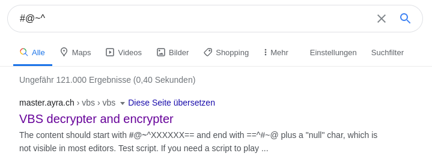

# Polyrun

## Solution

By the name of the challenge I could tell that it has to do something with a [Polyglot](https://en.wikipedia.org/wiki/Polyglot_(computing)). Nevertheless, I decided to spent some
time trying to reverse the program, which didn't lead to anything interesting, so I went back to the Polyglot assumption. <br/>
After trying multiple languages at https://tio.run/ and multiple hours of straight up looking at it without any success, I went for the other challenges.
<br/> <br/>
After almost two weeks, I thought of the comment, which is a common thing in Polyglots to make it work in different languages and the structure of it that reminded me of an encrypted string like base64 with the `UgAAAA==`:
```
#@~^UgAAAA==v,Zj;MPKtb/|r/|Y4+|0sCT{XKN@#@&H/T$G6,J;?/M,P_qj{g6K|I3)d{sJ)VTE~,#~rF}x^X~,JgGw^?JexkAAA==^#~@
```
The structure also looks kinda weird, starting with `#@~^` and ending with `^#~@`. Surely, this isn't just some random string. <br/>
Searching for `#@~^` returns this:
<br/> <br/>

<br/> <br/>
Using https://master.ayra.ch/vbs/vbs.aspx to decrypt the string:
```
' CSCG{This_is_the_flag_yo}
MsgBox "CSCG[THIS_NOT_REAL_FLAG]", VBOKOnly, "NoplSL
```

## Mitigation

Just don't. ¯\\\_(ツ)\_/¯


