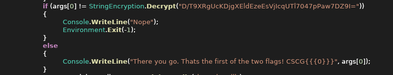

# reme Part 1

## Solution

Opening `ReMe.dll` in a .NET decompiler of your choice, in my case [ILSpy](https://github.com/icsharpcode/AvaloniaILSpy):



`D/T9XRgUcKDjgXEldEzeEsVjIcqUTl7047pPaw7DZ9I=` is the flag when decrypted. Copying the respective code and modifying it, so that it outputs the decrypted string:
```cs                                                                                                                                                                                                                                                                                                                                                                                                                                                                                                                                                                                                                                                                                                               ing System;
using System.IO;
using System.Security.Cryptography;
using System.Text;

namespace Rextester
{
    public class Program
    {
        public static void Main(string[] args)
        {
            Console.WriteLine(Decrypt("D/T9XRgUcKDjgXEldEzeEsVjIcqUTl7047pPaw7DZ9I="));
        }
        
        public static string Decrypt(string cipherText)
	{
	    string password = "A_Wise_Man_Once_Told_Me_Obfuscation_Is_Useless_Anyway";
	    cipherText = cipherText.Replace(" ", "+");
	    byte[] array = Convert.FromBase64String(cipherText);
	    using (Aes aes = Aes.Create())
	    {
		Rfc2898DeriveBytes rfc2898DeriveBytes = new Rfc2898DeriveBytes(password, new byte[13]
		{
		    73,
		    118,
		    97,
		    110,
    	            32,
		    77,
		    101,
		    100,
		    118,
		    101,
		    100,
		    101,
		    118
		});
	        aes.Key = rfc2898DeriveBytes.GetBytes(32);
		aes.IV = rfc2898DeriveBytes.GetBytes(16);
				
		using (MemoryStream memoryStream = new MemoryStream())
		{
		    using (CryptoStream cryptoStream = new CryptoStream(memoryStream, aes.CreateDecryptor(), CryptoStreamMode.Write))
		    {
			cryptoStream.Write(array, 0, array.Length);
			cryptoStream.Close();
		    }
		    cipherText = Encoding.Unicode.GetString(memoryStream.ToArray());
		}
	    }
	    return cipherText;
	}
    }
}
```

We can run this code in an online c# compiler like [dontnetfiddle.net](https://dotnetfiddle.net/fnOCPa) and get the decrypted string: `CanIHazFlag?` and therefore also the flag: `CSCG{CanIHazFlag?}`.


## Mitigation

https://stackoverflow.com/a/1283968/9717658

