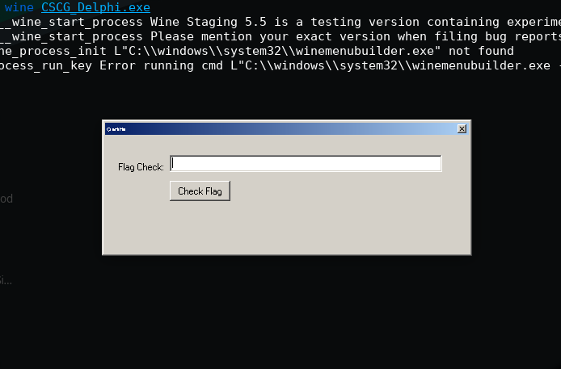
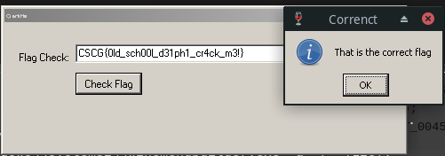

# win_eXPerience 2

## Solution

Searching for interesting processes:
```
$ volatility -f memory.dmp --profile=WinXPSP2x86 psscan | grep -i "cscg"
Volatility Foundation Volatility Framework 2.6.1
0x00000000017410c0 CSCG_Delphi.exe    1920   1524 0x0d835000 2020-03-22 18:27:45 UTC+0000
```

We can then dump the file:
```
$ volatility -f memory.dmp --profile=WinXPSP2x86 dumpfiles -n -p 1920 -D . -r CSCG_Delphi\.exe
Volatility Foundation Volatility Framework 2.6.1
ImageSectionObject 0x81aaa6b0   1920   \Device\HarddiskVolume1\Documents and Settings\CSCG\Desktop\CSCG\CSCG_Delphi.exe
DataSectionObject 0x81aaa6b0   1920   \Device\HarddiskVolume1\Documents and Settings\CSCG\Desktop\CSCG\CSCG_Delphi.exe
$ rm file.1920.0x81a90598.CSCG_Delphi.exe.dat
$ mv file.1920.0x81ab6698.CSCG_Delphi.exe.img CSCG_Delphi.exe
$ file CSCG_Delphi.exe
CSCG_Delphi.exe: PE32 executable (GUI) Intel 80386, for MS Windows
```

Okay, we got an executable now that also runs under wine and checks if the entered flag is valid:



Let's load the file into ghidra and search for "flag" to get to the function that validates our input:
```

/* WARNING: Globals starting with '_' overlap smaller symbols at the same address */

void FUN_004551d4(int param_1)

{
  undefined4 *puVar1;
  undefined4 extraout_ECX;
  int iVar2;
  int unaff_EBP;
  undefined4 *in_FS_OFFSET;
  bool bVar3;
  undefined4 uStack16;
  undefined *puStack12;
  
  puStack12 = &DAT_004554fb;
  uStack16 = *in_FS_OFFSET;
  *(undefined4 **)in_FS_OFFSET = &uStack16;
  _DAT_00458e10 = 0;
  FUN_0042f7c0(*(int *)(param_1 + 0x300),(int *)(unaff_EBP + -4));
  DAT_00458dd8 = FUN_004040d0(*(int *)(unaff_EBP + -4));
  DAT_00458de8 = 0;
  DAT_00458de0 = (undefined **)FUN_004030a8((int *)&PTR_FUN_00453b34,'\x01',extraout_ECX);
  FUN_00403e64(&DAT_00458dfc,(undefined4 *)"1EFC99B6046A0F2C7E8C7EF9DC416323");
  if (0 < DAT_00458dd8) {
    FUN_0042f7c0(*(int *)(param_1 + 0x300),(int *)(unaff_EBP + -8));
    puVar1 = (undefined4 *)FUN_004042d0(*(int *)(unaff_EBP + -8));
    FUN_00404008(&DAT_00458dd4,puVar1);
    if (*DAT_00458dd4 == 'C') {
      FUN_00403e64((int *)&DAT_00458e08,(undefined4 *)"25DB3350B38953836C36DFB359DB4E27");
      if ((DAT_00458dd4[2] == 'C') && (DAT_00458dd4[3] == 'G')) {
        FUN_00403e64((int *)&DAT_00458e00,(undefined4 *)"C129BD7796F23B97DF994576448CAA23");
        if (DAT_00458dd4[1] == 'S') {
          FUN_00403e64((int *)&DAT_00458e0c,(undefined4 *)"40A00CA65772D7D102BB03C3A83B1F91");
          if (DAT_00458dd4[4] == '{') {
            FUN_00403e64((int *)&DAT_00458e04,(undefined4 *)"017EFBC5B1D3FB2D4BE8A431FA6D6258");
            if (DAT_00458dd4[DAT_00458dd8 + -1] == '}') {
              if (0 < DAT_00458dd8) {
                DAT_00458dec = (char *)0x1;
                iVar2 = DAT_00458dd8;
                do {
                  if (DAT_00458dec[(int)(DAT_00458dd4 + -1)] == '_') {
                    DAT_00458de8 = DAT_00458de8 + 1;
                  }
                  DAT_00458dec = DAT_00458dec + 1;
                  iVar2 = iVar2 + -1;
                } while (iVar2 != 0);
              }
              if (DAT_00458de8 == 4) {
                _DAT_00458e10 = -1;
                FUN_004254dc(DAT_00458dd4,6,DAT_00458dd8 + -6,unaff_EBP + -0xc);
                FUN_00403e64(&DAT_00458dd4,*(undefined4 **)(unaff_EBP + -0xc));
                iVar2 = DAT_00458de8 + 1;
                if (0 < iVar2) {
                  DAT_00458df0 = 1;
                  do {
                    DAT_00458dec = FUN_00425500("_",DAT_00458dd4,1);
                    DAT_00458ddc = FUN_004040d0((int)DAT_00458dd4);
                    if (DAT_00458dec == (char *)0x0) {
                      DAT_00458dec = (char *)(DAT_00458ddc + 1);
                    }
                    bVar3 = DAT_00458dec + -1 == (char *)0x0;
                    FUN_004254ac(DAT_00458dd4,DAT_00458dec + -1,unaff_EBP + -0x10);
                    FUN_00403e64(&DAT_00458df4,*(undefined4 **)(unaff_EBP + -0x10));
                    FUN_004252c8(DAT_00458df4,(int *)(unaff_EBP + -0x14));
                    FUN_00403e64(&DAT_00458df4,*(undefined4 **)(unaff_EBP + -0x14));
                    FUN_004538f8(DAT_00458de0,DAT_00458df4,unaff_EBP + -0x28);
                    FUN_00453968(*DAT_00458de0,unaff_EBP + -0x28,(int *)(unaff_EBP + -0x18));
                    FUN_00403e64(&DAT_00458de4,*(undefined4 **)(unaff_EBP + -0x18));
                    FUN_0040421c(*(uint **)(&DAT_00458df8 + DAT_00458df0 * 4),DAT_00458de4);
                    if (!bVar3) {
                      _DAT_00458e10 = 0;
                    }
                    FUN_004254c4(DAT_00458dd4,DAT_00458ddc - (int)DAT_00458dec,unaff_EBP + -0x2c);
                    FUN_00403e64(&DAT_00458dd4,*(undefined4 **)(unaff_EBP + -0x2c));
                    DAT_00458df0 = DAT_00458df0 + 1;
                    iVar2 = iVar2 + -1;
                  } while (iVar2 != 0);
                }
              }
            }
          }
        }
      }
    }
  }
  if (_DAT_00458e10 == 0) {
    FUN_0044f018(*(int *)PTR_DAT_004577e4,"Looks like the wrong flag -.-","WRONG :P",0x10);
  }
  else {
    FUN_0044f018(*(int *)PTR_DAT_004577e4,"That is the correct flag","Correnct",0x40);
  }
  *in_FS_OFFSET = uStack16;
  puStack12 = (undefined *)0x4554e0;
  FUN_00403e10((int *)(unaff_EBP + -0x2c));
  puStack12 = (undefined *)0x4554ed;
  FUN_00403e34((int *)(unaff_EBP + -0x18),4);
  puStack12 = (undefined *)0x4554fa;
  FUN_00403e34((int *)(unaff_EBP + -8),2);
  return;
}
```

Looks like garbage, but luckily there is a collection of scripts that helps reversing delphi binaries called [dhrake](https://github.com/huettenhain/dhrake/). To get the IDC file necessary for the scripts, I started a Windows
VM and used [IDR](https://github.com/crypto2011/IDR) in combination with the Knowledge base `kb7.7z` that can be found at the link provied in the bottom of the README.

If we run `DhrakeInit.java` and provide it with the IDC file exported from IDR, we get a way better result:
```
/* WARNING: Globals starting with '_' overlap smaller symbols at the same address */

void TForm1.Button1Click(int param_1)

{
  undefined4 *puVar1;
  undefined4 extraout_ECX;
  undefined4 *local_14;
  int iVar2;
  undefined4 *in_FS_OFFSET;
  bool bVar3;
  undefined4 *local_30;
  undefined4 uVar4;
  undefined4 uStack32;
  undefined4 *local_1c;
  undefined4 *local_18;
  undefined4 *local_10;
  int local_c;
  int local_8;
  
  local_18 = (undefined4 *)&stack0xfffffffc;
  local_10 = (undefined4 *)0x5;
  do {
    local_8 = 0;
    local_10 = (undefined4 *)((int)local_10 + -1);
  } while (local_10 != (undefined4 *)0x0);
  local_1c = (undefined4 *)&DAT_004554fb;
  uStack32 = *in_FS_OFFSET;
  *(undefined4 **)in_FS_OFFSET = &uStack32;
  _DAT_00458e10 = 0;
  TControl.GetText(*(int *)(param_1 + 0x300),&local_8);
  DAT_00458dd8 = @LStrLen(local_8);
  DAT_00458de8 = 0;
  DAT_00458de0 = (undefined **)
                 TObject.Create((int *)&PTR_TIdHashMessageDigest4.HashValue_00453b34,'\x01',
                                extraout_ECX);
  @LStrAsg(&DAT_00458dfc,(undefined4 *)"1EFC99B6046A0F2C7E8C7EF9DC416323");
  if (0 < DAT_00458dd8) {
    TControl.GetText(*(int *)(param_1 + 0x300),&local_c);
    puVar1 = (undefined4 *)@LStrToPChar(local_c);
    @LStrFromPChar(&DAT_00458dd4,puVar1);
    if (*DAT_00458dd4 == 'C') {
      @LStrAsg((int *)&DAT_00458e08,(undefined4 *)"25DB3350B38953836C36DFB359DB4E27");
      if ((DAT_00458dd4[2] == 'C') && (DAT_00458dd4[3] == 'G')) {
        @LStrAsg((int *)&DAT_00458e00,(undefined4 *)"C129BD7796F23B97DF994576448CAA23");
        if (DAT_00458dd4[1] == 'S') {
          @LStrAsg((int *)&DAT_00458e0c,(undefined4 *)"40A00CA65772D7D102BB03C3A83B1F91");
          if (DAT_00458dd4[4] == '{') {
            @LStrAsg((int *)&DAT_00458e04,(undefined4 *)"017EFBC5B1D3FB2D4BE8A431FA6D6258");
            if (DAT_00458dd4[DAT_00458dd8 + -1] == '}') {
              if (0 < DAT_00458dd8) {
                DAT_00458dec = (char *)0x1;
                iVar2 = DAT_00458dd8;
                do {
                  if (DAT_00458dec[(int)(DAT_00458dd4 + -1)] == '_') {
                    DAT_00458de8 = DAT_00458de8 + 1;
                  }
                  DAT_00458dec = DAT_00458dec + 1;
                  iVar2 = iVar2 + -1;
                } while (iVar2 != 0);
              }
              if (DAT_00458de8 == 4) {
                _DAT_00458e10 = -1;
                AnsiMidStr(DAT_00458dd4,6,DAT_00458dd8 - 6,(LPSTR *)&local_10);
                @LStrAsg(&DAT_00458dd4,local_10);
                iVar2 = DAT_00458de8 + 1;
                if (0 < iVar2) {
                  DAT_00458df0 = 1;
                  do {
                    DAT_00458dec = PosEx("_",DAT_00458dd4,1);
                    DAT_00458ddc = @LStrLen((int)DAT_00458dd4);
                    if (DAT_00458dec == (char *)0x0) {
                      DAT_00458dec = (char *)(DAT_00458ddc + 1);
                    }
                    AnsiLeftStr(DAT_00458dd4,DAT_00458dec + -1,&stack0xffffffec);
                    @LStrAsg(&DAT_00458df4,local_14);
                    AnsiReverseString(DAT_00458df4,(int *)&local_18);
                    @LStrAsg(&DAT_00458df4,local_18);
                    TIdHash128.HashValue(DAT_00458de0,DAT_00458df4,&stack0xffffffd4);
                    TIdHash128.AsHex(*DAT_00458de0,(int)&stack0xffffffd4,(int *)&local_1c);
                    @LStrAsg(&DAT_00458de4,local_1c);
                    bVar3 = @LStrCmp(*(char **)(&DAT_00458df8 + DAT_00458df0 * 4),DAT_00458de4);
                    if (!bVar3) {
                      _DAT_00458e10 = 0;
                    }
                    AnsiRightStr(DAT_00458dd4,DAT_00458ddc - (int)DAT_00458dec,&stack0xffffffd0);
                    @LStrAsg(&DAT_00458dd4,local_30);
                    DAT_00458df0 = DAT_00458df0 + 1;
                    iVar2 = iVar2 + -1;
                  } while (iVar2 != 0);
                }
              }
            }
          }
        }
      }
    }
  }
  if (_DAT_00458e10 == 0) {
    uVar4 = 0x10;
    TApplication.MessageBox(*(int *)Application,"Looks like the wrong flag -.-","WRONG :P",0x10);
  }
  else {
    uVar4 = 0x40;
    TApplication.MessageBox(*(int *)Application,"That is the correct flag","Correnct",0x40);
  }
  *in_FS_OFFSET = uVar4;
  local_1c = (undefined4 *)&LAB_00455502;
  uStack32 = 0x4554e0;
  @LStrClr((int *)&stack0xffffffd0);
  uStack32 = 0x4554ed;
  @LStrArrayClr((int *)&local_1c,4);
  uStack32 = 0x4554fa;
  @LStrArrayClr(&local_c,2);
  return;
}
```

There are also MD5 hashes that can be cracked with `https://www.onlinehashcrack.com/`:
```
017EFBC5B1D3FB2D4BE8A431FA6D6258    1hp13d
40A00CA65772D7D102BB03C3A83B1F91    !3m
C129BD7796F23B97DF994576448CAA23    l00hcs
25DB3350B38953836C36DFB359DB4E27    kc4rc
1EFC99B6046A0F2C7E8C7EF9DC416323    dl0
```

Admittedly, I didn't realise immediately the meaning behind them, but after a bit of reversing, we can see that the input is splitted by `_` and that there needs to be 4x `_` in the flag:
```
                do {
                  if (DAT_00458dec[(int)(DAT_00458dd4 + -1)] == '_') {
                    DAT_00458de8 = DAT_00458de8 + 1;
                  }
                  DAT_00458dec = DAT_00458dec + 1;
                  iVar2 = iVar2 + -1;
                } while (iVar2 != 0);
              }
              if (DAT_00458de8 == 4) {
```
And then the string is reversed and compared with the MD5 hash value:
```
                    AnsiReverseString(DAT_00458df4,(int *)&local_18);
                    @LStrAsg(&DAT_00458df4,local_18);
                    TIdHash128.HashValue(DAT_00458de0,DAT_00458df4,&stack0xffffffd4);
                    TIdHash128.AsHex(*DAT_00458de0,(int)&stack0xffffffd4,(int *)&local_1c);
                    @LStrAsg(&DAT_00458de4,local_1c);
                    bVar3 = @LStrCmp(*(char **)(&DAT_00458df8 + DAT_00458df0 * 4),DAT_00458de4);
```

If we put all of that together and check the memory address of the hashes for the right order, we get the flag:
```
3 017EFBC5B1D3FB2D4BE8A431FA6D6258    1hp13d	-> d31ph1
5 40A00CA65772D7D102BB03C3A83B1F91    !3m	-> m3!
2 C129BD7796F23B97DF994576448CAA23    l00hcs	-> sch00l
4 25DB3350B38953836C36DFB359DB4E27    kc4rc	-> cr4ck
1 1EFC99B6046A0F2C7E8C7EF9DC416323    dl0 	-> 0ld

CSCG{0ld_sch00l_d31ph1_cr4ck_m3!}
```

Double Checking:




## Mitigation

The same as in the win_eXPerience 1 write-up.
